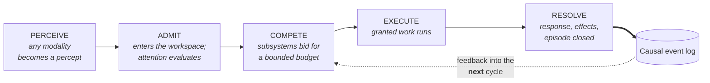
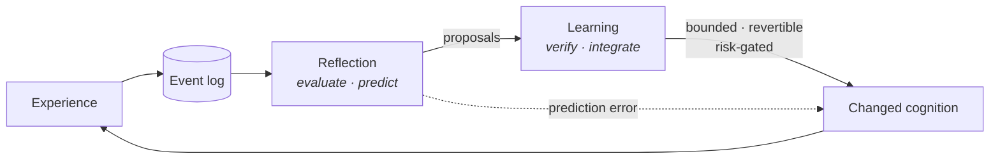

# Ashi

**A lifelong Cognitive Operating System for one human.**

This repository is the public architectural specification of Ashi: what the system is, how
it is structured, why it is structured that way, and — with equal care — what currently
works versus what is designed but not yet built.

The implementation is private. The architecture is not.

---

## The idea

Most AI assistants are functions. Excellent ones, often — but a function has no biography.
It resets, re-derives, re-asks, and has nothing at stake in having been wrong last week.
Memory added to a stateless call is a feature, not a different kind of system.

Ashi is built on a different target: **an entity whose identity, convictions, and
experience survive the replacement of its model, its provider, its database, its operating
system, and its hardware — while changing continuously without becoming a different
individual.**

Getting there requires one structural commitment that most assistant architectures cannot
make. A system whose behaviour genuinely improves from experience needs **cycles** in its
component graph: an outcome must be able to change what gets recalled next time, which
changes the next outcome. A strictly one-directional pipeline forbids that by construction,
no matter how good each stage is.

Ashi resolves this with a single primitive: an **immutable, persisted causal event log**.
Forward flow *within* one cognitive cycle stays acyclic and debuggable. Feedback flows
*only* through the log, into later cycles. That one addition supplies four things at once —
the feedback edge, the substrate reflection needs to evaluate past behaviour, the
reconstruction source that lets identity survive partial data loss, and a causal record
that makes any output traceable back to the perceptions that produced it.

One primitive resolving four unrelated problems is the best available evidence that it is
the right primitive.

---

## What Ashi is not

- **Not a chatbot.** A response is one possible outcome of a cognitive cycle. Silence is
  another. Cycles also begin with no human input at all.
- **Not an LLM wrapper.** Models are replaceable executors behind a routing layer.
  Cognition is the log, the stores, and the cycle that mediates them.
- **Not RAG.** Retrieval is one contributor bidding for a bounded budget, and it can lose.
- **Not an agent loop.** Every outward action passes a permission boundary, and a claimed
  success is re-checked through a different capability than the one that claimed it.
- **Not a claim about AGI or machine consciousness.** Structure is borrowed from cognitive
  science; nothing is asserted about the phenomena those words describe in humans.

---

## How Ashi thinks

One cognitive cycle:

Subsystems are not called in a fixed order with fixed cost. They **bid** — declaring how
urgent their contribution is, how valuable they estimate it to be, and what it would cost —
and an attention policy allocates a bounded per-cycle budget. A trivial exchange produces
low bids and a cheap cycle, without a hardcoded list of trivial exchanges.

Nothing reaches a model prompt except by winning attention. This bounds context by
construction rather than by truncation, and it is what makes continuous ambient perception
tractable instead of a firehose.

## How Ashi changes

The longer loop closes across cycles, never inside one:

Reflection evaluates closed episodes and never writes. Learning verifies proposals against
existing beliefs and commits them only through each subsystem's own validated path. Every
change is an event, is bounded, and is revertible. **Ashi tunes itself inside a sandbox it
cannot escape** — and the values and constraints that define what it is *for* sit in an
immutable core no automated process may touch.

---

## The core systems

| System | What it does |
|---|---|
| **[Perception](docs/architecture/subsystems.md#1-perception)** | Observes the world on its own schedule, off the conversation path, and publishes a snapshot a turn can read for free |
| **[Attention](docs/architecture/subsystems.md#3-attention)** | Scores salience, runs the bid competition, and is the single admission point into any prompt |
| **[Memory](docs/architecture/subsystems.md#4-memory)** | Working, episodic, semantic, and procedural stores; scoped hierarchical retrieval; decay, reinforcement, consolidation, forgetting |
| **[Knowledge](docs/architecture/subsystems.md#5-knowledge-and-belief)** | Entities, facts, and relationships; beliefs with evidence and confidence; contradiction detection and revision that cascades |
| **[Reasoning](docs/architecture/subsystems.md#6-reasoning)** | A family of inference strategies selected per request — and a hard rule that inference never silently becomes belief |
| **[Planning](docs/architecture/subsystems.md#8-planning)** | Goals that decompose and carry provenance; plans as dependency graphs; commitments that come due |
| **[Execution](docs/architecture/subsystems.md#9-execution)** | Action proposals, risk classification, human approval, and verification after the fact |
| **[Reflection](docs/architecture/subsystems.md#10-reflection)** | Evaluates what happened, predicts, and treats surprise as the signal to change |
| **[Learning](docs/architecture/subsystems.md#11-learning)** | Turns evaluated experience into bounded, revertible change |
| **[Identity](docs/architecture/subsystems.md#13-identity)** | Versioned, code-independent data with an immutable core — never prompt text |

Full detail, including what each interacts with and where each stands:
**[docs/architecture/subsystems.md](docs/architecture/subsystems.md)**.

---

## Continuity

The naive target is perfect backup. That is a solved problem and the wrong one: a backup is
a single artifact a failure can destroy, and restoring it is all-or-nothing.

Ashi engineers **continuous degradation** instead — identity degrades gradually with data
loss rather than failing catastrophically, and any surviving fragment reconstitutes as much
of Ashi as that fragment supports. State is tiered by *reconstructibility* rather than size,
which forces the question most systems avoid: **what is the minimum that is still Ashi?**

The committed answer is values, constraints, and personality. Every memory, belief, and
skill can in principle be relearned by the same individual. Those three cannot be lost
without producing a different one.

→ **[docs/architecture/continuity.md](docs/architecture/continuity.md)**

## One cognition, many surfaces

There is one Ashi: a long-running local process owning the log, the stores, and the cycle.
Terminal, browser, and voice are thin clients that submit percepts and render results. No
surface runs cognition; no surface holds authoritative state. This is why switching from
voice to text mid-thought continues the same conversation, and why identity survives
replacing every surface.

→ **[docs/architecture/experience.md](docs/architecture/experience.md)**

---

## Where Ashi stands

**Running today.** The causal event log; the cognitive cycle with its full contributor set;
attention bidding under a budget that genuinely rejects; all four memory systems with
scoped hierarchical retrieval; the knowledge and belief system including contradiction
detection and cascading revision; the reasoning strategy family; goals, plans, projects,
episodes, and commitments that survive process restarts; the permission boundary with
approval, expiry, and resume; reflection and learning on a background path; a protected
identity; ambient world perception that never touches the conversation path.

**Recently proven end to end.** Natural language → local structured inference → a plan → an
action proposal → the permission boundary → a real provider → a real change on disk,
verified by inspecting the result independently rather than trusting the report. Multi-step
dependency-ordered execution and self-repairing plan revision are proven the same way.

**Built but not yet used by a person.** The artifact system and the voice pipeline both
work and have never been exercised by a human being.

**Designed, not built.** Deterministic re-execution replay and its counterfactual variant;
the tiered portable export archive; the degradation ladder as a *tested* property; the
tutor.

**Honestly weak.** Post-execution verification covers one class of action; everything else
reports itself unverified rather than passing silently. Long-horizon improvement from the
learning loop is unmeasured and not claimed. Some execution paths are not yet sandboxed.

→ **[docs/status/](docs/status/README.md)** for capability-level detail.

---

## Documentation

| | |
|---|---|
| **[Vision](docs/vision/README.md)** | Why Ashi exists, and what makes it structurally different |
| **[Principles](docs/vision/principles.md)** | Design principles and the invariants that enforce them |
| **[Architecture](docs/architecture/README.md)** | How the system fits together: log, feedback, layering, degradation |
| **[Cognitive OS](docs/architecture/cognitive-os.md)** | What the term means, and Ashi's placement against adjacent systems |
| **[Cognitive cycle](docs/architecture/cognitive-cycle.md)** | The cycle as a mechanism, and how far it is built |
| **[Subsystems](docs/architecture/subsystems.md)** | Every major subsystem in depth |
| **[Continuity](docs/architecture/continuity.md)** | Tiers, reconstruction, portability, degradation |
| **[Experience](docs/architecture/experience.md)** | Surfaces, multimodality, consent |
| **[Status](docs/status/README.md)** | What Ashi can do today, and what it cannot |
| **[Roadmap](docs/roadmap/README.md)** | Where it is going |
| **[Research](docs/research/README.md)** | The open questions, labelled by how open they are |
| **[Diagrams](assets/diagrams/README.md)** | The conceptual diagram set |

Start with [Vision](docs/vision/README.md) for the argument, or
[Architecture](docs/architecture/README.md) for the mechanism.

---

## Public and private

This repository explains **what** Ashi does, **why** it is designed that way, and **how**
the architecture works conceptually. It does not describe how the private code implements
it.

Published: concepts, principles, architecture, subsystem relationships, mechanisms,
invariants, lifecycle and state models, design rationale, capability status, research
direction, roadmap.

Not published: source code and layout, package internals, wiring, database schemas,
configuration, credentials, infrastructure, deployment, or operational procedure.

The boundary is drawn so the architecture is genuinely useful to someone thinking about
similar problems, without functioning as a reconstruction guide.

---

## FAQ

**Is the code open source?**
No. The architecture is public; the implementation, prompts, and evaluation data are not.

**How is this different from an assistant with a memory feature?**
Four structural differences, not one feature: retrieval competes for a bounded budget
rather than running unconditionally; outcomes feed back into what gets recalled, through a
causal log; beliefs carry evidence and are revised when contradicted rather than
overwritten; and identity is protected data with an immutable core rather than a system
prompt. Any one is a feature. Together they are a different architecture.

**Why single-user?**
Because the interesting problem is longitudinal depth about one person, and nearly every
mechanism that delivers it — a single persistent relationship state, goal-scoped retrieval,
identity as protected data — is either much harder or meaningless multi-tenant.

**Does it outperform a frontier model on single-turn tasks?**
Almost certainly not, and it is not built for that. The design chooses a better system in a
year over a better answer in this turn.

**How much of the architecture actually exists?**
Most of the substrate; a meaningful fraction of the behaviour. That question is what
[docs/status/](docs/status/README.md) exists to answer, per capability, without rounding up.
