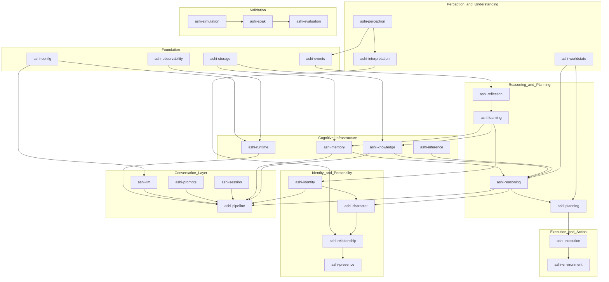
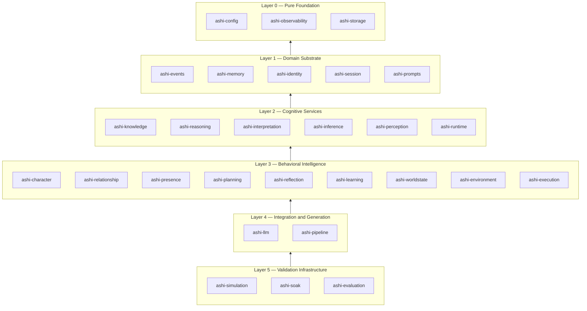

# Ashi

> A personal cognitive operating system — built from first principles to think alongside one person, not to serve everyone generically.

---

## Table of Contents

1. [What is Ashi](#what-is-ashi)
2. [Why Closed Internals, Open Concept](#why-closed-internals-open-concept)
3. [System Overview](#system-overview)
4. [Subsystem Breakdown](#subsystem-breakdown)
5. [Current Status](#current-status)
6. [Design Principles](#design-principles)
7. [About the Builder](#about-the-builder)
8. [Discussion](#discussion)

---

## What is Ashi

Most AI assistants are designed to be useful to everyone, which means they are optimized for none. They reset after every conversation, treat each interaction as stateless, and apply the same generic framing regardless of who they are talking to. They are tools in the strictest sense — capable of answering questions, but incapable of accumulating understanding.

Ashi is built on a different thesis: that a genuinely useful AI companion must develop a *longitudinal model of one person* — their goals, habits, knowledge gaps, relationship with the builder, and how they think — and bring that model to bear on every interaction. This is the problem of **personal cognitive augmentation**, and it requires architectural commitments that off-the-shelf assistant frameworks fundamentally cannot make. It requires persistent memory with structured retrieval, a belief system that evolves under evidence, goal tracking that survives session boundaries, and an identity layer that is stable enough to be trusted but adaptive enough to remain accurate.

The project draws on theory from cognitive science and AI research — among other things, global workspace theory, cognitive architecture research, and work on episodic and semantic memory — and applies those ideas under real constraints: consumer hardware, a single developer, and the requirement that the system behave coherently under long-running operation, not just in a controlled demo. Ashi is not a chatbot with memory bolted on. It is an attempt to build something closer to what the literature calls a **cognitive architecture**: a system where perception, reasoning, memory, knowledge, identity, and action are integrated subsystems with defined interfaces, not a single black-box model call surrounded by scaffolding.

---

## Why Closed Internals, Open Concept

This repository documents the design and architecture of Ashi — the subsystems, their purposes, and the reasoning behind architectural decisions. The implementation (source code, prompt text, schemas, trained artifacts, and benchmark data) remains private.

This is a deliberate and standard practice in independent research, for two reasons. First, Ashi's effectiveness depends in part on its prompting and identity configuration; exposing those would undermine the system's integrity for the person it is built for. Second, independent research benefits from being able to iterate freely without the overhead of maintaining a public codebase. The architecture documentation here is intended to be useful on its own — for researchers interested in cognitive architecture design, engineers thinking about similar problems, or anyone curious about what a first-principles personal AI system actually looks like structurally.

---

## System Overview

The diagram below shows Ashi's major subsystems and the conceptual flow between them. Arrows represent informational or coordinative dependencies at the architectural level, not runtime call sequences.

The second diagram shows the layered dependency structure — which subsystems are foundational versus which are consumers:

---

## Subsystem Breakdown

Every package in the monorepo is represented below. Descriptions are kept at the conceptual level: what the subsystem is responsible for and why it exists, not how it is implemented.

| Package | Layer | Description |
|---|---|---|
| **ashi-config** | Foundation | Type-safe, hierarchical configuration loading. The single source of truth for all runtime settings across the system. |
| **ashi-observability** | Foundation | Structured logging and telemetry foundation. Provides the instrumentation layer all other subsystems emit through. |
| **ashi-storage** | Foundation | Thin, generic persistence layer and versioned schema migrations. The substrate the memory, knowledge, and relationship backends build on. No ORM, no query builder — each subsystem owns its own queries. |
| **ashi-events** | Domain Substrate | Append-only, immutable, replayable cognitive event log. Records every significant system action — perception, recall, inference, decision, outcome — as a durable, structured event stream available for reflection and audit. |
| **ashi-session** | Domain Substrate | Conversational session management. Tracks the current interaction boundary, state, and metadata that the pipeline and runtime need to correctly scope a turn. |
| **ashi-identity** | Domain Substrate | Ashi's persistent identity model: personality traits, values, communication style, and architectural profile. The single authoritative writer of identity state. |
| **ashi-prompts** | Domain Substrate | Prompt template management — storage, loading, versioning, and policy enforcement for the text templates the pipeline assembles into model inputs. Treated as a managed artifact, not hard-coded strings. |
| **ashi-llm** | Conversation Layer | LLM service core — provider registry, credential pooling, request routing, response caching, context management, and multi-provider failover. The sole subsystem that interacts with cloud language model providers. |
| **ashi-runtime** | Cognitive Infrastructure | The shared cognitive execution environment: a tick-loop-driven engine composed of workspace, attention competition, executive control, and cognitive cycle machinery. Coordinates which cognitive contributors run each turn and in what order. |
| **ashi-memory** | Cognitive Infrastructure | Memory system foundation — shared record model, lifecycle contracts, storage abstractions, registry, and manager facade. Defines the interface that all memory backends (working, episodic, semantic, procedural) implement against. |
| **ashi-knowledge** | Cognitive Infrastructure | Knowledge graph, belief system, and extraction pipeline. Maintains a persistent property graph of entities, relationships, and facts; a confidence-weighted belief layer over claims; and an assimilation pipeline for extracting new knowledge from observations. |
| **ashi-inference** | Cognitive Infrastructure | Bounded, structured, local inference platform. A model-agnostic abstraction for running constrained, structured inference on-device. Distinct from ashi-llm — never produces free text, never contacts a cloud provider. |
| **ashi-perception** | Perception & Understanding | Cognitive perception pipeline. Transforms a raw input observation into an immutable, structured cognitive reading through a sequential pipeline of semantic, structural, specialist, and situational analysis stages. The formal entry point for all incoming information. |
| **ashi-interpretation** | Perception & Understanding | Human communication interpretation. Detects sarcasm, irony, indirect requests, emotional masking, hesitation, ambiguity, and other pragmatic signals before reasoning or relationship evaluation. Produces a structured result with confidence and evidence, never a single binary flag. |
| **ashi-worldstate** | Perception & Understanding | Persisted, single-user world state model. What is true about the user's world right now: current projects, active context, available resources, and open commitments. Persists across sessions; distinct from the ephemeral per-turn reasoning aggregate. |
| **ashi-character** | Identity & Personality | Behavioral intelligence layer. Determines how Ashi's existing reasoning is expressed each turn: tone, teaching vs. challenging vs. asking, confidence phrasing, and action type. Reads identity read-only; never writes it. |
| **ashi-relationship** | Identity & Personality | Relationship intelligence. Maintains and evolves a persistent model of the human relationship — trust, loyalty, shared history, protectiveness, humor — across real sessions. Refines behavioral directives through the lens of accumulated relationship context. |
| **ashi-presence** | Identity & Personality | Conversational presence shaping. Transforms cognitive decisions into Ashi's actual conversational rhythm, pacing, initiative, teaching flow, and style. Governs how character is expressed, not what is decided. |
| **ashi-reasoning** | Reasoning & Planning | Reasoning engine. Assembles an ephemeral world model from memory and knowledge, then applies inference strategies to produce a structured conclusion with a calibrated confidence trace. Read-only with respect to all persistent stores. |
| **ashi-planning** | Reasoning & Planning | Goal formation, decomposition, and plan construction. Translates reasoning conclusions into persistent goals, decomposed tasks, and sequenced action proposals. Plans but does not execute. |
| **ashi-reflection** | Reasoning & Planning | Reflection engine. Consumes the cognitive event log and produces structured, reviewable proposals for memory reinforcement, belief revision, knowledge extraction, and identity adjustment. Produces proposals; never applies them — that is learning's responsibility. |
| **ashi-learning** | Reasoning & Planning | Learning engine. Applies reflection's proposals by verifying each one against current state and committing accepted changes exclusively through the validated write paths of the relevant domain subsystems. Never writes to storage directly. |
| **ashi-environment** | Execution & Action | Operating environment abstraction. Platform-neutral models and port interfaces for filesystem, process, window, clipboard, notification, application discovery, device, system info, and OS permission operations. Defines the surface; platform adapters implement it. |
| **ashi-execution** | Execution & Action | Execution engine. Manages the full lifecycle of Ashi acting in the world: decision modelling, risk classification, permission boundary enforcement, tool management, provider orchestration, and execution audit. Every action passes through the permission boundary before any provider runs it. |
| **ashi-simulation** | Validation | Deterministic digital-life world simulator. Generates virtual environments, declarative human agent models, physics constraints, and action validation logic for extended testing. No dependency on any cognitive subsystem — consumed by soak testing, not the reverse. |
| **ashi-soak** | Validation | Long-running soak testing framework. Runs Ashi through extended, realistic simulated life scenarios (student, researcher, engineer, founder, manager personas) to validate cognitive stability, behavior under failure, decision quality, and conversation coherence over time. |
| **ashi-evaluation** | Validation | Measurement and evaluation infrastructure. A uniform benchmark protocol, runner, result history, and threshold-based regression detection. Out-of-band tooling that benchmarks subsystems without being wired into the cognitive cycle. |
| **ashi-pipeline** | Conversation Layer | Prompt generation pipeline. The stage-based assembly system that draws on identity, session, memory, knowledge, reasoning, and character subsystems to compose the final model input each turn. The integration point where cognitive context becomes a structured prompt. |

---

## Current Status

Ashi is under active solo development. The foundational architecture is complete and operational: the cognitive runtime, LLM infrastructure, memory foundation, knowledge graph and belief system, identity model, session management, and event log are built and running. The behavioral intelligence layer — character, interpretation, relationship, presence — is implemented. The reasoning engine, planning system, reflection engine, and learning engine are implemented. The execution and environment layers are implemented. The perception platform and world state model are implemented. The local inference platform is in its infrastructure phase.

The validation infrastructure — simulation, soak testing, and evaluation benchmarking — has been built and exercised. Subsystems have been tested and validated against defined criteria at both the unit and integration levels.

Current focus is on the local cognitive inference platform and the continued deepening of the long-horizon memory and knowledge systems that make session-spanning continuity reliable. Later phases will address autonomous planning and execution under real operating environment conditions, and the integrity of the system under extended real-world use.

---

## Design Principles

- **Solo-built under real constraints.** Ashi is designed and implemented by a single person on consumer hardware. Every architectural decision accounts for this — no subsystem requires infrastructure a solo operator cannot reasonably run. This constraint produces better design: it forces prioritization, explicit interfaces, and genuine modularity rather than distributed-team scalability theater.

- **Separation of concerns enforced by structure, not convention.** The 28-package monorepo is not organisational convenience. It reflects a deliberate architectural rule: every subsystem has a defined role and a defined set of things it is not allowed to do. Memory does not reason. Reflection does not write. Character does not override identity. These boundaries are enforced by dependency structure, making violations visible at build time.

- **First principles over frameworks.** Ashi does not use an agent framework, a memory library, or a cognitive architecture toolkit. Each subsystem is built from scratch against interfaces designed for this specific problem. Frameworks introduce abstractions that are correct for their target use case; Ashi's use case is different enough that accepting those abstractions would mean inheriting their constraints.

- **Long-horizon correctness over short-horizon capability.** The design consistently favors being correct across sessions over being impressive within one. A reflection engine that proposes but does not apply is safer than one that commits changes directly. The conservative path is chosen deliberately and repeatedly, particularly in subsystems that write to persistent state.

- **The event log as the ground truth for introspection.** Everything Ashi observes, reasons about, decides, and acts upon is recorded as a durable, structured event. This makes the system auditable, makes reflection possible without coupling it to live subsystems, and means the system's own history is available for learning — not lost in a rolling context window.

---

## About the Builder

Ashi is designed and built by Ashish Dhankecha, a fifth-semester Computer Engineering student. The project began as a serious investigation into what it would actually take to build a personal AI system that behaves coherently over long time horizons — not a demo, not a proof of concept, but something intended to run continuously alongside real work. The long-term trajectory is toward graduate research (MS/PhD) and an independent AI research lab focused on personal cognitive systems and human-AI collaboration that goes beyond the current generation of assistant products.

The architecture documented here represents a sustained period of iterative design, several major architectural revisions, and a deliberate commitment to building the hard parts correctly rather than the easy parts quickly.

---

## Discussion

Questions about the architecture, design decisions, or the theoretical basis for any subsystem are welcome. Open an issue — that is the right venue for substantive technical discussion.

Contributions to the implementation are not open at this time, as the codebase remains private. Architectural feedback, questions about design tradeoffs, and pointers to relevant research are genuinely useful.
