# Conceptual Diagrams

The complete diagram set for Ashi, in one place. Several are reproduced inline in the
documents where they carry an argument.

These are conceptual diagrams of how the system thinks — not of module structure, internal
wiring, or deployment. Status is annotated *inside* the diagrams where it matters, so that
a reader who sees only the picture does not come away believing that re-admission rounds,
duplex voice, or the mobile surface already exist.

---

## 1. System overview

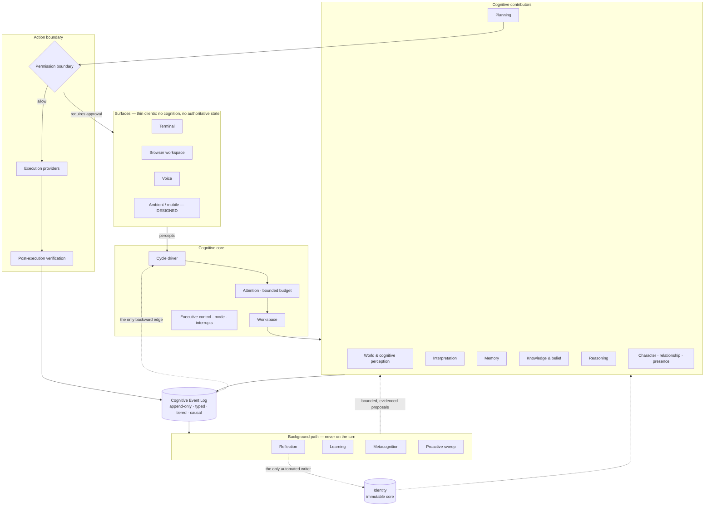

---

## 2. The cognitive cycle

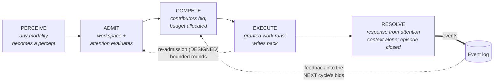

**Read the dotted edges carefully.** Re-admission is designed and not built. The feedback
edge is real, but it is *between* cycles, never within one — that is what keeps the forward
path acyclic and debuggable.

---

## 3. The cognitive feedback loop

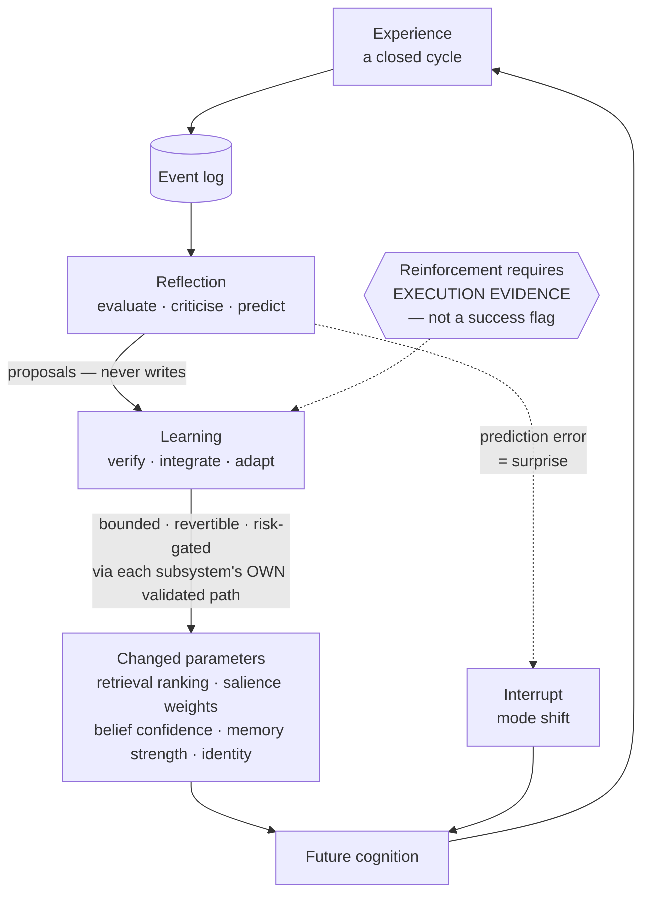

The gate is the fix for a real defect: without it, retrieval frequency wore an outcome
label and the loop converged on whatever was most active rather than on what worked.

---

## 4. Memory lifecycle

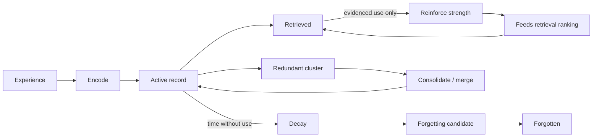

### Retrieval order

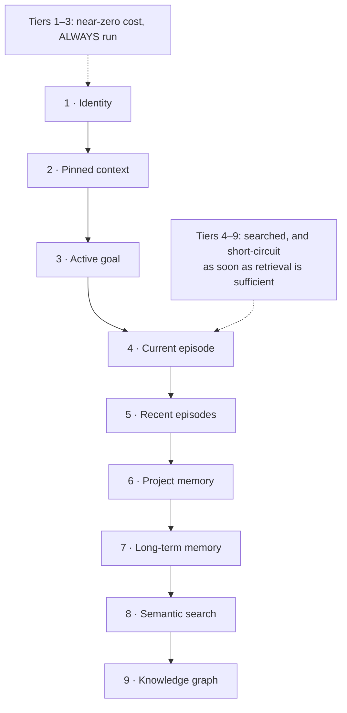

---

## 5. Knowledge and belief model

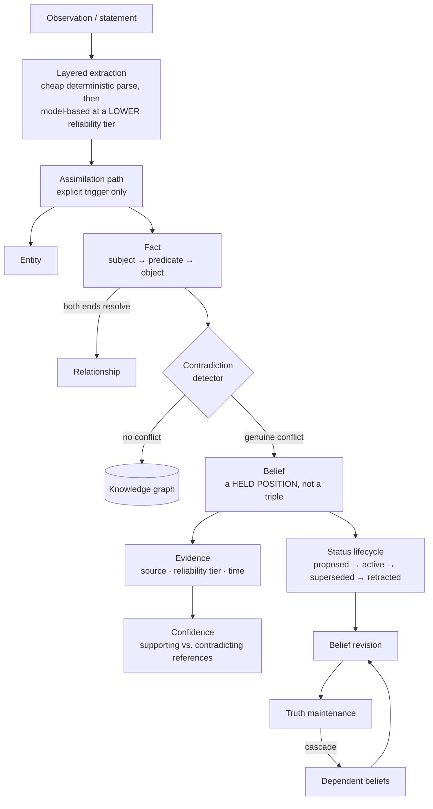

**A belief is formed only on a genuine conflict.** Forming one per fact duplicated the
entire graph — a real defect, fixed.

---

## 6. Attention competition

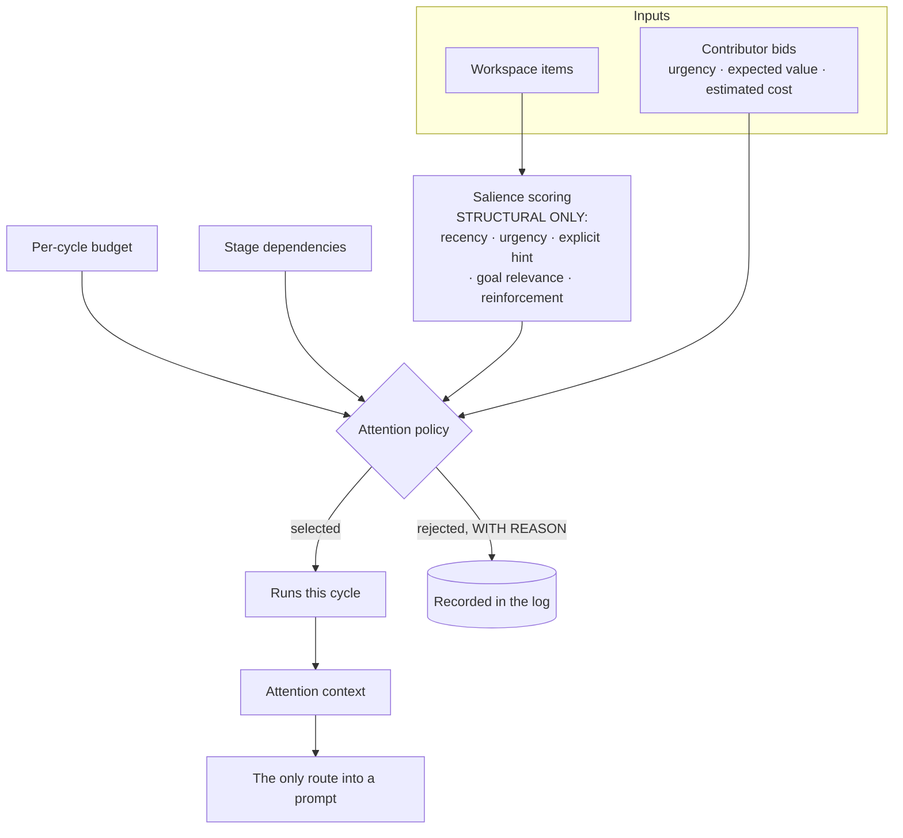

Salience never looks at content. That constraint — adopted for simplicity — is why the
mechanism is modality-agnostic for free: an image and a line of text compete identically.

---

## 7. Reflection → learning loop

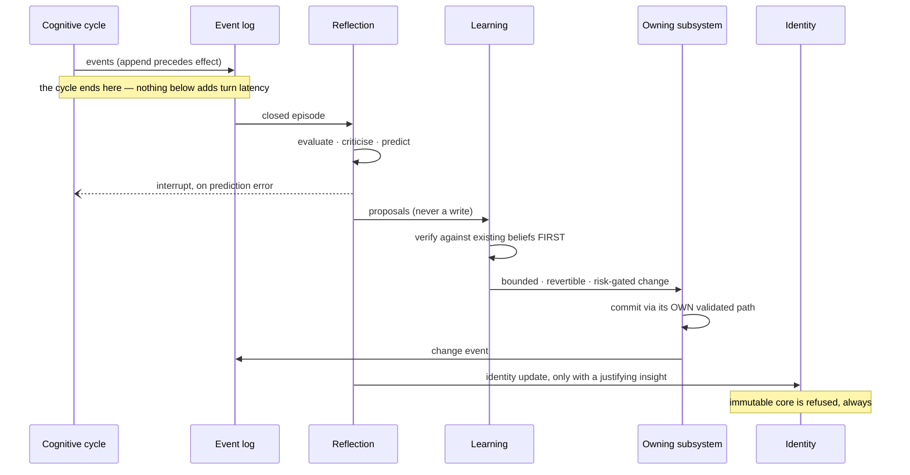

---

## 8. Identity and continuity

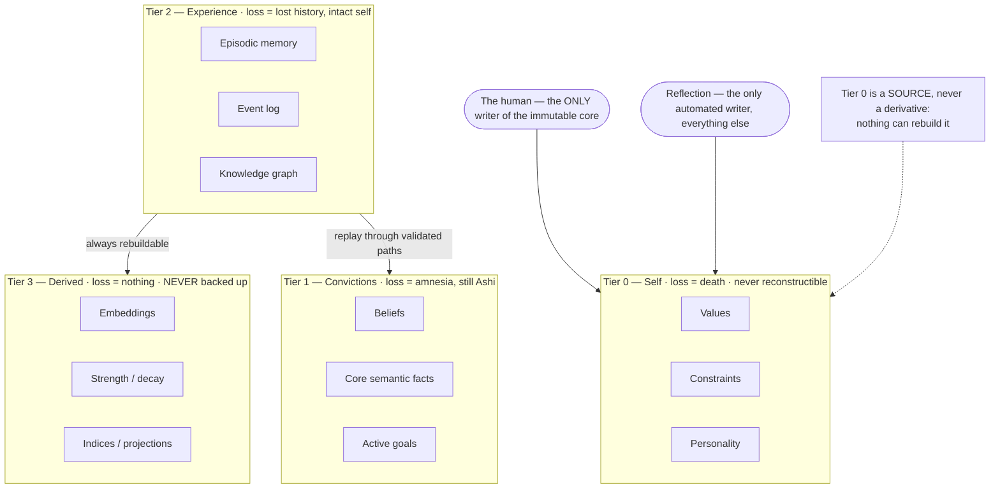

**Backup frequency is inverse to reconstructibility, not proportional to size.**

---

## 9. Planning → permission → execution

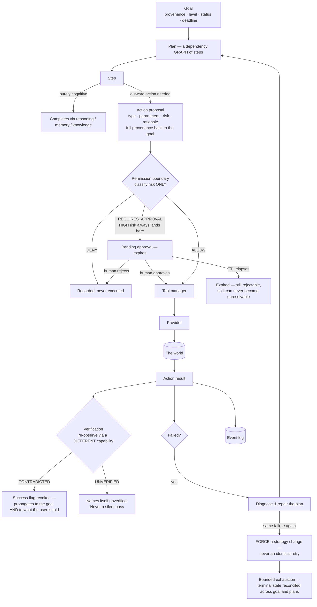

Two rules encoded here that were learned expensively: **an empty plan is a failure, not a
success**, and **a provider's self-report is not evidence.**

---

## 10. One cognition, many surfaces

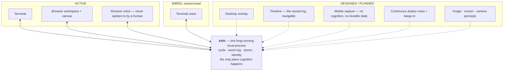

**A surface is a view, and a view is not part of who Ashi is.** This is why switching from
voice to text mid-thought continues the same conversation, and why identity survives
replacing every surface.

---

## Keeping them consistent

A diagram that contradicts the prose is worse than no diagram. When a mechanism changes,
the prose changes first, then the diagram — and the status labels inside diagrams 2 and 10
are checked against [what Ashi can do today](../../docs/status/README.md).
