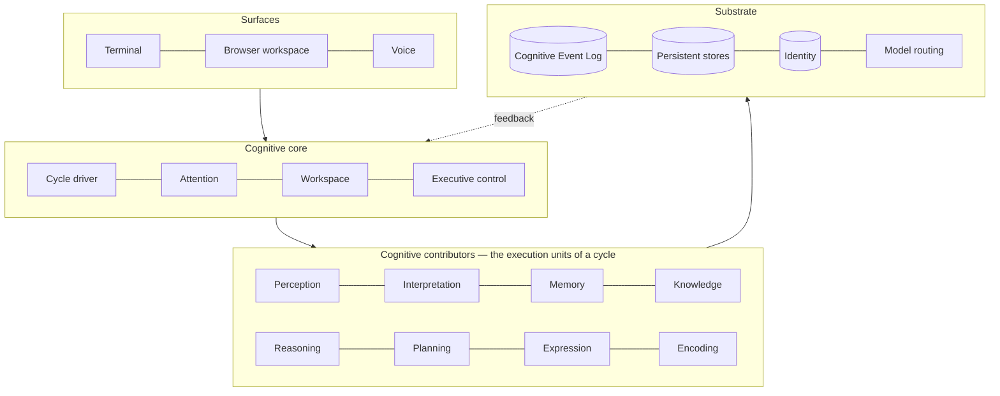
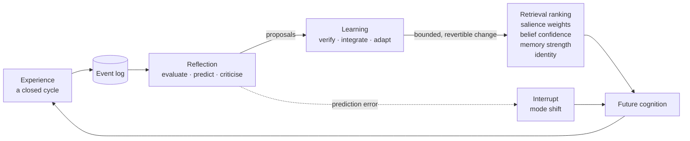

# Architecture

The conceptual architecture of Ashi: what the parts are, how information moves, how
cognition feeds back into future cognition, and where the boundary between deciding and
acting sits.

| Document | Contains |
|---|---|
| **README.md** (this file) | System overview, layering, the event log, feedback, degradation |
| [`cognitive-os.md`](cognitive-os.md) | What "Cognitive OS" means; why this is not a chatbot, RAG system, or agent loop |
| [`cognitive-cycle.md`](cognitive-cycle.md) | The cycle as a mechanism; designed shape vs. current behaviour |
| [`subsystems.md`](subsystems.md) | Every major subsystem in depth |
| [`continuity.md`](continuity.md) | Tiers, reconstruction, portability, migration, degradation |
| [`experience.md`](experience.md) | One cognition, many surfaces |

---

## 1. The shape of the system

Ashi is one long-running local process. Inside it, four layers:

Two rules give the layering its meaning:

- **Dependencies point strictly downward.** No subsystem imports upward. Where a lower
  layer needs a capability from a higher one, the *consumer* defines the interface and the
  application layer supplies the implementation. This is why the memory subsystem has no
  knowledge of any model provider despite needing embeddings.
- **The only upward path is the event log.** Feedback is not a return value.

---

## 2. The Cognitive Event Log

The spine of the system. An append-only, immutable, persisted sequence of typed events.

Each event carries: a monotonic gap-free sequence number; the cycle it belongs to; a
timestamp; a category; the subsystem that emitted it; a typed payload; a **retention and
reconstruction tier**; and — the important field — **the events that caused it**.

That last field is what makes the log a **causal graph rather than a timeline**. It is
what "explainability" is delivered by: walking backwards from any output to the percepts
that produced it is a graph traversal, not a request for a model to narrate its own
reasoning.

### Rules

- **Append precedes effect.** A subsystem that mutates a store without first emitting an
  event has created state that cannot be reconstructed. This is why the ordering is an
  invariant rather than a convention.
- **Events are never updated or deleted.** Correction is a *new* event whose causal links
  point at what it corrects — the same discipline the belief system applies to beliefs,
  generalised to the whole system.
- **Durability and queryability are separated.** The durable artifact is a line-oriented
  append-only file; the indexed database table is a *projection* that can be dropped and
  rebuilt. This is deliberate and is explained in [`continuity.md`](continuity.md): a
  truncated line-oriented file is readable up to the truncation, and a truncated binary
  dump is worthless.

### Event categories

Thirteen categories, grouped by what they are *about*:

- **Cognitive operations** — percept, recall, inference, decision, action, outcome,
  revision, reflection.
- **Structural bookkeeping** — cycle lifecycle, contributor lifecycle, attention decisions,
  intent classification, world-state change.

A new *category* is added only when the architecture grows a genuinely new phase of
cognition or structural concern. A subsystem needing a new payload shape uses a new
payload type under an existing category — a much narrower change, with precedent.

One deliberate, disclosed exception to "the log is the source of cognitive history": the
current-world-state singleton and the relationship state are *not* reconstructed by
replaying their events. Their rows are authoritative and the events are an audit trail.
This is documented as an exception rather than pretended away.

**Status: ACTIVE and VERIFIED.** The log runs on every cycle, the causal graph is
traversable, and a trace facility reads it.

---

## 3. Feedback: how cognition changes future cognition

This is the mechanism the whole architecture exists to support, so it is worth stating
precisely.

Four properties make this a controlled loop rather than uncontrolled drift:

1. **Reflection proposes; learning applies.** Reflection never writes to a store. Learning
   never writes directly either — it commits through each subsystem's own validated write
   path, so every guarantee those paths enforce still holds.
2. **Every change is bounded, risk-gated, and revertible.** Higher-risk proposals cannot
   auto-apply. Ashi tunes itself inside a sandbox it cannot escape.
3. **Reinforcement requires execution evidence.** A reinforcement signal that fires every
   turn measures retrieval frequency, not usefulness — and because ranking reads strength
   back, such a loop is self-confirming. Reinforcement is gated on real execution evidence
   rather than on a success flag, so a turn that correctly decided to do nothing neither
   reinforces nor weakens anything.
4. **Prediction error is the interrupt signal.** Reflection registers expectations after a
   cycle completes; when a later outcome diverges, it raises an interrupt. Surprise — not a
   timer — is what makes the system shift mode or surface something proactively. *A system
   that interrupts on a timer is a notification system; a system that interrupts on
   surprise is a colleague.*

**Status: ACTIVE.** Reflection and learning both run on the background path and their
outputs are consumed. **Behavioural improvement from the loop is `UNMEASURED`** — the loop
demonstrably runs and demonstrably writes; that it makes Ashi better over months has not
been independently measured against a baseline, and is not claimed.

---

## 4. The hot path and the background path

A hard split, and one of the most consequential decisions in the system.

**Hot path** — everything inside one user-facing turn. Bounded by an attention budget.
Cannot be blocked by background work.

**Background path** — reflection, learning, metacognition, world perception, the proactive
sweep, consolidation, maintenance. Runs on a shared scheduler outside the turn.

Guarantees and non-guarantees, both stated:

- **Guaranteed:** causal correctness. Every background event follows the hot-path cycle it
  concerns.
- **Not guaranteed:** a total order *between* independent background handlers. Two
  handlers reacting to the same cycle have no defined relative completion order. This was
  found during certification and is disclosed rather than papered over, because code that
  assumes an order would be silently wrong.

The most important consequence of the split is a hard rule about perception:

> **No conversation turn may walk the filesystem, invoke a version-control tool, or spawn
> a subprocess.**

The turn reads one immutable snapshot via a lock-free attribute load. Ambient perception
runs off the turn path, on its own cadence, and is **LLM-free by contract** — an ambient
loop that consumed model quota would exhaust it before the user typed anything.

The measured result: the turn-path cost of world perception is on the order of tens of
microseconds — a rounding error against multi-second response latency — while the ambient
pass itself is a fraction of a second, once per minute, at low single-digit percent of one
CPU core, with no snapshot growth over repeated passes.

---

## 5. Model routing as a replaceable layer

Models are executors. The routing layer treats them accordingly:

- Multiple providers and multiple model tiers, with health tracked **per (provider, model)
  pair** rather than per provider — a lesson from a real outage in which one model's
  failures marked an entire provider unhealthy and took the system down.
- Rate-limit rejections are excluded from health counters. A quota rejection is not a sick
  model.
- When every candidate looks unhealthy, routing degrades to the least-unhealthy candidate
  rather than returning nothing. Reduced capability beats failure.
- A per-request classification narrows which cognitive stages run at all, which is the
  sanctioned lever for latency.

Two consequences worth stating:

- **Request budget is an architectural constraint, not an operational detail.** Model calls
  are finite per day, and cognition that spends them indiscriminately starves the
  interaction that matters. This is why ambient perception is model-free by contract, why
  reflection runs on closed episodes rather than continuously, and why classification
  narrows which stages run at all.
- **Latency is dominated by reasoning.** Response-start latency has been cut by roughly a
  factor of six from its worst measured baseline, and reasoning accounts for about half of
  what remains. Reducing it further means classifying requests more accurately — a
  correctness problem rather than a performance one.

---

## 6. Degradation

Reduced capability always beats failure, made structural.

| Level | Lost | Ashi still does |
|---|---|---|
| **L0** | Nothing | Full cognition |
| **L1** | Cloud providers | Local model only; degraded reasoning quality |
| **L2** | Embeddings / vector index | Structural recall — recency, session, graph |
| **L3** | Knowledge store | Memory-only context; no belief grounding |
| **L4** | Memory store | Session-local context; identity intact |
| **L5** | Everything but the identity tier | Announces its own condition and offers reconstruction |

Every optional dependency in the system is guarded such that its absence narrows behaviour
instead of failing the cycle. That is `ACTIVE` by construction and continuously exercised
in practice — components genuinely are absent in some configurations, and the system runs.

**The ladder as a systematically injected and asserted fault sequence is `UNMEASURED`.**
Fault-injection tooling exists and has been exercised, and the system has absorbed long
runs of consecutive provider failures without crashing. That is worth something, and it is
not the same as measured recovery: a degradation ladder is only a property once each rung
has been forced and the resulting behaviour asserted.

---

## 7. Why this is not `input → LLM → output`

Six structural reasons, each of which is a place the linear pipeline breaks:

1. **A turn may produce no response.** A cycle can conclude that nothing needs saying.
2. **A cycle may be triggered by no input.** The proactive sweep, a reflection trigger, and
   an ambient percept all start cycles no human initiated.
3. **The stages that run are decided per cycle by competition**, not fixed in source.
4. **The prompt is an output of attention**, not an input to the system. What reaches the
   model is what won a bounded budget.
5. **The most consequential work happens after the response** — reflection, learning,
   consolidation, verification — and changes the next cycle.
6. **Acting is a separate, gated path.** A decision to act is not an action. It becomes one
   only after risk classification, possibly human approval, and it is re-verified
   afterwards through a different capability than the one that acted.
