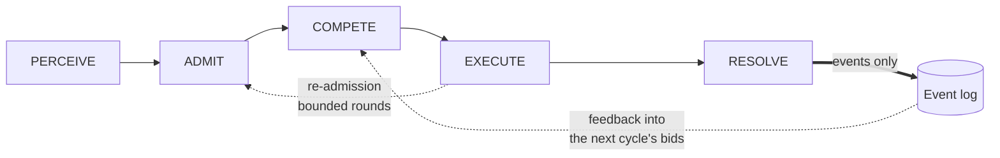
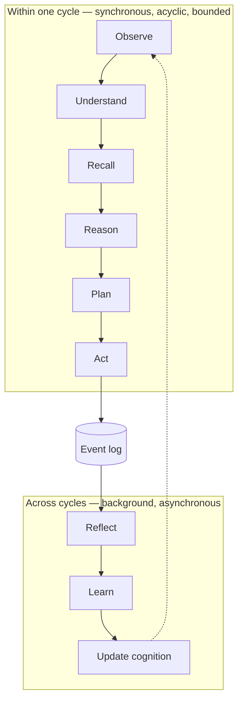

# The Cognitive Cycle

One cycle is one lap: a percept arrives, contributions compete and execute, a response
and effects are produced, the episode closes. Cycles are the unit of cognition, the unit
of causal attribution, and the unit of replay.

This document describes the cycle as an **architectural mechanism**, and then states
plainly where **current production behaviour** is narrower than the architecture. Those
are two different things and are never merged here.

---

## 1. The architectural cycle



### PERCEIVE

Any modality produces a percept. Text typed by the user is one percept source. A voice
segment, a screen capture, a filesystem change, a scheduled reflection trigger, and a
proactive sweep are others. **Nothing about the cycle is conversation-specific** — this is
what makes ambient and multimodal input an extension rather than a parallel system.

A percept carries its modality, its content (inline when small, by reference when large),
its capture time, its source, and — critically — its **consent scope**, which travels with
it through the log and bounds where it may be persisted.

### ADMIT

The percept enters the workspace. Attention evaluates. The resulting attention context is
the cycle's working state, and is the only thing a prompt may be built from.

### COMPETE

Every registered contributor is offered the current context and declares a bid: how urgent
this is, how valuable the contributor estimates its own contribution to be, at what
estimated cost, and — for tracing, never for a model — why.

**Bidding is cheap, synchronous, and does no I/O.** It is a declaration of intent, not
work. This is what makes competition affordable enough to run every cycle.

An attention policy then allocates the bounded per-cycle budget.

### EXECUTE

Granted contributors run within their budget, write results back to the workspace, and
emit events. A contributor exceeding its grant is cancelled; its partial work is discarded
and the cancellation is recorded.

### Re-admission

After execution, attention re-evaluates. If new high-salience content appeared, another
competition round runs — bounded by a maximum round count and the total budget. *This is
where genuine emergence lives, which is exactly why the bound is explicit and configurable
rather than absent.*

### RESOLVE

The response, if any, is generated from the attention context alone, and streamed. The
cycle closes with an event summarising what was admitted, what competed, what won, and
what was produced.

---

## 2. Current production behaviour

Everything below is `ACTIVE` unless marked otherwise.

**What matches the architecture:**

- Percepts, including non-conversational ones, drive cycles. Reflection triggers, the
  proactive sweep, and ambient world perception all exist and fire.
- Every registered contributor is asked for a bid, once per cycle, before execution.
- An attention policy performs real selection under a real per-cycle budget, and
  **genuinely rejects**. It is a priority-ordered dependency-respecting selection, not a
  sort.
- The attention context is the single admission point for retrieved and derived content
  entering a prompt.
- The cycle, contributor, and attention decisions are all recorded as events with causal
  links, so any cycle is fully reconstructible after the fact.

**What is narrower than the architecture, and how:**

| Architectural mechanism | Current behaviour | Status |
|---|---|---|
| Bids may abstain (`None`) | Every contributor returns a bid; eligibility is a field on it | PARTIALLY_ACTIVE |
| Budget granted per contributor by value ÷ cost | A subset is *selected* to fit a total budget; individual grants are not issued | PARTIALLY_ACTIVE |
| Contributors run concurrently within grants | Fixed phase order, with a small whitelisted group of independent stages awaited concurrently | PARTIALLY_ACTIVE |
| Cancellation on budget overrun | Not implemented | DESIGNED |
| Bounded re-admission rounds | Not implemented — one competition round per cycle | DESIGNED |

**One calibration point is easy to misread.** The budget binds only on complex turns —
deliberately, so that ordinary turns are never starved of the stages they need. "The budget
rarely rejects" therefore looks like evidence that attention is a pass-through, and it is
not. The related concern it resembles — many low-value items crowding out one important
one — belongs to the workspace and salience layer, which is a different mechanism with a
different dial.

---

## 3. The cycle's fixed stage backbone

The current cycle has a closed, ordered set of stages. It is closed on purpose: adding one
means a genuinely new step in cognition, not a new capability of an existing step, and
requires a recorded architectural decision.

In order:

```
PERCEPT ─▶ PERCEPTION ─▶ INTERPRETATION ─▶ MEMORY RECALL ─▶ BELIEF RECALL
   ─▶ WORLD STATE ─▶ UNDERSTANDING ─▶ REASONING ─▶ PLANNING ─▶ BEHAVIOUR
   ─▶ RELATIONSHIP ─▶ PRESENCE ─▶ ACTION
   ─▶ MEMORY ENCODING ─▶ KNOWLEDGE ASSIMILATION ─▶ RELATIONSHIP UPDATE ─▶ WORLD STATE UPDATE
```

Three structural properties worth naming:

- **Read stages precede the decision; write stages follow it.** Memory recall and memory
  encoding are separate stages, as are relationship read and relationship update, and
  world-state read and world-state update. There is exactly one place each kind of state is
  written.
- **Understanding precedes reasoning; expression follows it.** Interpretation — what the
  person actually meant, including sarcasm, hesitation, indirect requests — runs before
  memory and reasoning. Character, relationship, and presence run *after* the decision and
  refine only how it is expressed. Presence structurally cannot change what Ashi does: its
  output type has no field capable of expressing an action.
- **Planning sits between reasoning and expression.** It needs reasoning's output to judge
  whether the turn warrants forming or advancing a goal, and expression can then honestly
  report on plan progress.

---

## 4. The lifelong loop

The nine-step loop people usually mean by "cognitive cycle" — observe, understand, recall,
reason, plan, act, reflect, learn, update cognition — is **not one cycle**. It spans many,
and it closes through the event log.



Trying to fit reflection and learning inside a single turn was the original architecture's
mistake: it made reflection unable to influence recall, because recall precedes reflection
in a chain and nothing carries information backwards. Splitting them across the log is what
resolves it, and it has the pleasant side effect that reflection can never add
user-perceived latency.

**Status:** the within-turn half is `ACTIVE` and runs every turn. The across-cycles half is
`ACTIVE` — reflection and learning genuinely run in the background and genuinely write.
That the loop produces measurable improvement over time is `UNMEASURED`.

---

## 5. Executive control and interrupts

The cycle is not the only thing that can decide what happens. An executive layer holds
cognitive mode and handles interrupts:

| Trigger | Source | Effect |
|---|---|---|
| Voice barge-in | Audio stream | Cancel in-flight execution; the partial output is logged, not lost |
| Prediction error | Reflection | Mode shift toward focused cognition |
| Budget exhaustion | Cycle driver | Degrade to a minimum viable cycle |
| Idle threshold | Scheduler | Background mode — reflection and consolidation |
| User focus signal | Surface | Focused mode — ambient percepts suppressed |

The partial-output detail is a good example of the log paying for itself: because a
cancelled response's partial output is an event, *"as I was saying"* is a **retrieval**
rather than a regeneration.

**Status: PARTIALLY_ACTIVE.** The executive, interrupt manager, and mode machinery are
implemented and wired. Prediction-error-driven interrupts and budget degradation are live.
Voice barge-in is `DESIGNED` — the current voice path is turn-based, not continuous duplex.
