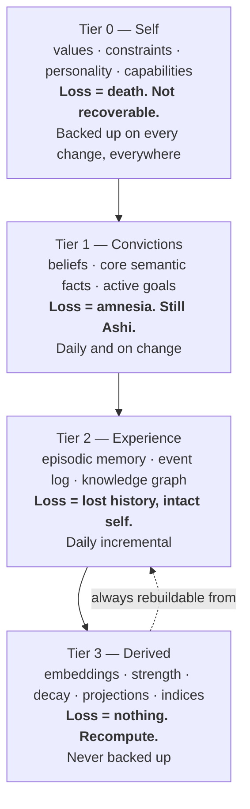

# Continuity

How Ashi is meant to survive model replacement, hardware replacement, OS replacement,
database replacement, restart, migration, and partial data loss — without becoming a
different individual.

This is the part of the architecture with the largest gap between what is specified and
what is built, and the gap is stated explicitly throughout rather than at the end.

---

## 1. The property being engineered

The naive target is perfect backup. That is a solved and uninteresting problem, and it is
the wrong target: a backup is a single artifact that a failure or an attacker can destroy,
and restoring it is all-or-nothing.

The correct target is **continuous degradation**:

> Identity degrades continuously with data loss instead of failing catastrophically. Any
> surviving fragment reconstitutes as much of Ashi as that fragment supports.

This is both stronger and more achievable than lossless backup, and it is what a system
intended to last decades actually requires. Such a system *will* experience partial loss.
The engineering question is whether partial loss is survivable or terminal.

---

## 2. Cognitive tiers

Every piece of state belongs to exactly one tier. Tiering is by **reconstructibility**, not
by size — and backup frequency is inverse to reconstructibility rather than proportional to
volume.

### The rules

- **Derived state is always reconstructible** from durable state plus the event log.
  Anything that is not is misclassified and must move down a tier.
- **Each tier must be reconstructible-*enough*** from the tier above plus the log. Not
  identically — *enough to still be Ashi at that tier's fidelity*.
- **A tier boundary must be physically enforceable.** Storing derived data *inside* a
  durable record makes the boundary unenforceable and inflates every backup with
  regenerable bytes. This was a real instance: embeddings stored inside memory records.

### The question the tiers force

Defining Tier 0 requires answering *what is the minimum that is still Ashi?* That is a
cognitive-architecture question, not a backup question, and the original architecture never
asked it.

The committed answer: **values, constraints, and personality.**

Everything else — every memory, every belief, every skill — can in principle be relearned
by the same individual. Those three cannot be lost without producing a different one. This
is also exactly why the immutable identity core exists: the tier that cannot be
reconstructed is the tier no automated process may edit.

**Status: PARTIALLY_ACTIVE.** Tier assignment is a real field on every event and is
carried through the system. Physical separation of derived state from durable records is
partially done. Tier-directed backup policy is `DESIGNED`.

---

## 3. Reconstruction, not restore

Recovery should rebuild what it can and **report what it could not**, rather than aborting.
The architectural target is a boot that says, in effect: *I have lost my beliefs. I still
have my identity and forty-one thousand episodes. Rebuilding beliefs from the event log
will take about twenty minutes and recover roughly eighty percent by volume. Facts asserted
before the log's retention horizon are unrecoverable; there are three hundred and twelve of
them and I can list them.*

| Lost | Rebuilt from | Fidelity |
|---|---|---|
| All derived state | Durable state + log | Exact |
| Beliefs | Log replay through the assimilation path | High — revision history preserved |
| Knowledge graph | Log replay | High |
| Episodic memory | The log (episodes *are* events) | Exact within retention |
| Goals | Log + convictions tier | High |
| **Identity** | **Nothing. It is a source, never a derivative.** | — |

Replay-based reconstruction is only sound because of the *append precedes effect*
invariant. A subsystem that mutates state without a prior event has created
unreconstructable state — which is why that ordering is an invariant rather than a
convention.

**Status.** Faithful reconstruction of what the log contains is `ACTIVE`, including
detection of truncation, corrupted records, and sequence gaps. **Re-executing cognition
from the log — the property that would make belief and knowledge reconstruction real
rather than theoretical — is `DESIGNED` and not built.** Degraded boot with a per-tier
condition report is `DESIGNED`.

---

## 4. Portability

### Format as a continuity decision

The architecture specifies a self-describing archive requiring **no database, no schema
version, and no Ashi code to read**: a manifest with checksums and counts, and one
line-oriented file per state class.

The reasoning is the single most consequential format decision in the system:

> **A truncated line-oriented file is readable up to the truncation. A truncated binary
> dump is worthless.**

Corruption costs the damaged lines and nothing else, and recovery is possible for a human
with no tooling at all. This is the format-level expression of continuous degradation, and
it is why the event log is line-oriented on disk with the indexed database as a droppable
projection, rather than database-native with an export bolted on.

**Import into a fresh, empty database is the substrate-independence test.** It is what
turns "replaces hardware, databases, operating systems" from an aspiration into a verified
property.

**Status: DESIGNED.** What exists instead is a **conventional consistent backup and
restore** that captures the database and the filesystem state *together* — which matters,
because a database dump alone silently loses the identity and the conversation history,
both of which live on the filesystem. That is genuinely useful and it is `ACTIVE` and
`IMPLEMENTED`. It is **not** the tiered self-describing archive, it is not
tool-independent, and the export-wipe-import-verify drill has never been run. This is
recorded as one of the largest open gaps in the system.

---

## 5. Cognitive state persistence

Content persistence is solid. **In-flight cognitive state persistence is not.**

Workspace contents, the attention context, cognitive mode, and in-flight work are
discarded on restart, by explicit original design.

The consequence used to be mild — Ashi restarted mid-conversation having forgotten what it
was attending to. It is no longer mild, because plans now exist: a restart during execution
discards in-flight cognitive state.

Partial mitigation is real and shipped: goals, plans, steps, projects, episodes, and
commitments are all persisted and demonstrably survive real process restarts, and an
episode can be restored on boot. What is not persisted is the *transient* cognitive state —
the workspace and attention context of the cycle that was interrupted.

**Status: PARTIALLY_ACTIVE.** Durable planning and episode state: `ACTIVE` and `VERIFIED`
across multiple real restarts. A snapshot of transient cognitive state: `DESIGNED`.

---

## 6. Migration

Three migrations the architecture must eventually survive, all currently `PLANNED`:

**Model migration.** Swap provider or model and verify that identity and beliefs stay
stable. The intended instrument is counterfactual replay — re-run real historical cycles
under the new model and diff against ground truth already in the log. That instrument does
not exist yet, which is why model migration cannot currently be *verified*, only performed.

Partial credit where it is due: the routing layer already swaps providers and model tiers
continuously under health and quota pressure, so provider independence is exercised daily
even though it has never been certified.

**Embedding migration.** Re-index derived state under a new embedding model with no change
to durable state. This is precisely why derived state must not live inside durable records.
An incremental ledger already exists to make re-embedding bounded rather than a full
rescan.

**Schema evolution.** Additive migrations are `ACTIVE` and routine. Non-additive schema
evolution is `PLANNED`.

---

## 7. Degradation

The declared ladder is in [`README.md`](README.md#6-degradation). Two things to add here:

- Every optional dependency in the system is guarded such that absence *narrows* behaviour
  rather than failing the cycle. This is `ACTIVE` by construction and exercised in practice,
  because components genuinely are absent in some configurations.
- The ladder as a **systematically injected and asserted** sequence is `UNMEASURED`.
  Fault-injection tooling exists and has been exercised, and the system has absorbed long
  runs of consecutive provider failures without crashing. A degradation ladder only becomes
  a property once each rung has been forced deliberately and the resulting behaviour
  asserted against the table above — which has not been done, and is not being counted as
  though it had.

---

## 8. Summary of continuity status

| Property | Status |
|---|---|
| Identity as portable, code-independent, versioned data | **ACTIVE** |
| Immutable identity core enforced against automated writers | **ACTIVE** |
| Tier assignment carried on events | **ACTIVE** |
| Durable planning/episode/commitment state across restart | **ACTIVE, VERIFIED** |
| Consistent database + filesystem backup and restore | **ACTIVE** |
| Log reconstruction with corruption and gap diagnosis | **ACTIVE** |
| Physical separation of derived state from durable records | **PARTIALLY_ACTIVE** |
| Tiered, tool-independent, self-describing export archive | **DESIGNED** |
| Export → wipe → import into a fresh database, verified | **DESIGNED** |
| Re-execution replay from the log | **DESIGNED** |
| Counterfactual replay with a changed component | **DESIGNED** |
| Degraded boot with per-tier condition reporting | **DESIGNED** |
| Transient cognitive-state snapshot | **DESIGNED** |
| Model / embedding / hardware migration rehearsals | **PLANNED** |
| Degradation ladder as an injected, asserted property | **UNMEASURED** |

The pattern is consistent and worth naming: **the parts of continuity that operate every
day are built and proven; the parts that only matter during a disaster are specified and
untested.** That is the normal failure mode of disaster recovery everywhere, it is not
special to Ashi, and the correct response is to run the drill rather than to describe it
better.
