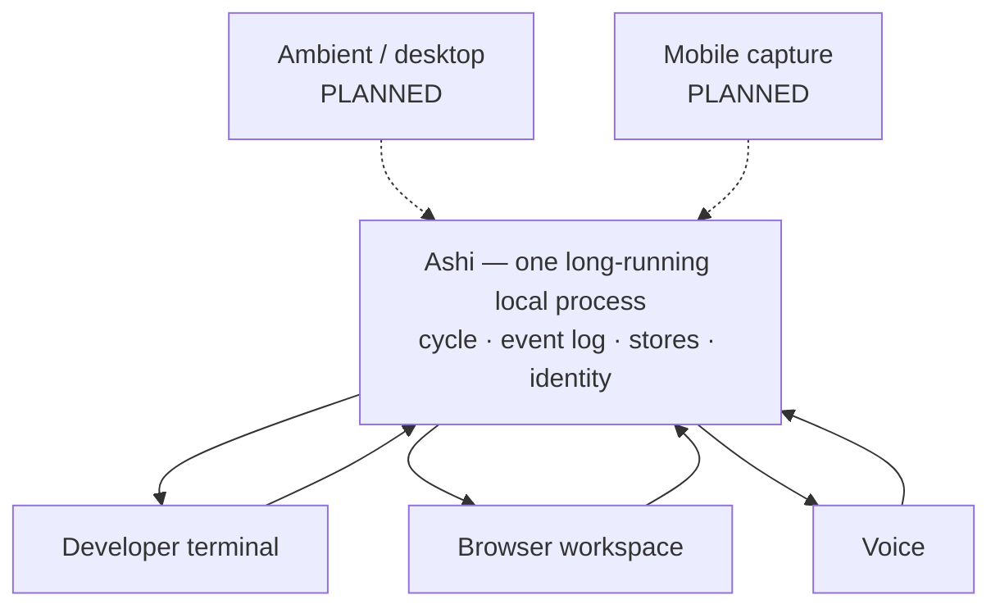

# Experience — One Cognition, Many Surfaces

Architecture is not only backend. This document specifies how Ashi is inhabited, and where
the current reality sits against the intended design.

---

## 1. The principle

There is **one** Ashi: a long-running local process owning the event log, the stores, and
the cognitive cycle. Every surface is a thin client that submits percepts and renders
results.

- **No surface runs cognition.**
- **No surface holds authoritative state.**

This is why identity survives surface replacement: **surfaces are views, and a view is not
part of who Ashi is.** It is also why switching from voice to text mid-thought continues
the same conversation — the surface was never holding the state.

The strongest evidence that the principle is real rather than aspirational: text, browser
voice, and the terminal voice path are all driven through the **same** entry point, and
workspace-selection context folds into cognition identically across all of them. There is
no per-surface cognition to keep in sync, because there is only one.

---

## 2. What exists today

### Developer terminal — `ACTIVE`

The primary surface. Full conversational interaction, plus explicit commands for approving
and rejecting pending actions, indexing documents, creating and revising artifacts,
pinning the current project focus, and — usefully — asking *why* a given turn produced what
it did, which renders the causal trace and per-stage timings.

That last one deserves a note: it is the explainability principle delivered as a
**product surface** rather than as a debugging affordance. The answer to "why did you say
that?" is a structural walk of the causal graph, not a model narrating itself.

### Browser workspace — `ACTIVE`, partially verified

A real frontend with a conversational surface, a canvas that renders generated visual
artifacts and supports click-to-select feeding the selection back into cognition, and an
artifact workspace with structural editors, undo and redo, and real optimistic-concurrency
conflict handling rather than silent overwrite.

**Verified by live browser use:** artifact rendering, click-to-select, and contextual
cognition on the selection. **Not verified:** most of the artifact workspace's editing
surface, which is type-checked and backend-tested but has never been clicked through by a
person.

### Voice — working in the browser, wired in the terminal, never spoken to

A complete pipeline: capture, speech recognition, the same cognition every other surface
uses, speech synthesis, playback. Turn-based rather than continuous duplex.

Two properties of this surface are worth naming because they are easy to get wrong. A
connection indicator must reflect the state of the backend rather than an assumption about
it, and a voice turn must survive the things only live use produces — audio too short to
decode, a release race between the interface and the recorder, and concurrent requests
touching shared session state. That last one has a failure mode worse than a dropped turn:
a crash mid-write can leave *persisted* session state in a shape that fails on every
subsequent start, turning a transient error into a permanent one. Each is now guarded.

**A live human voice conversation has never happened.** The pipeline works; nobody has
spoken to it.

---

## 3. What is designed and not built

### Ambient desktop — `DESIGNED`

Four surfaces in decreasing prominence, of which only the third partially exists:

- **Overlay.** A global hotkey opening a single input accepting text, voice, a screenshot,
  or a file, responding inline and dismissing to nothing. The intended 95% interaction, and
  the one with a hard sub-200ms latency requirement.
- **Timeline.** The event log rendered for a human — what Ashi perceived, recalled,
  concluded, and did, with causal links, where clicking any conclusion walks back to the
  percepts that produced it.
- **Canvas.** Where generated artifacts render, interactively. Partially exists in the
  browser workspace.
- **Ambient layer.** Proactive surfacing, strictly rate-limited by budget and mode.

Three behaviour rules are specified and worth stating because they define what "ambient"
means here:

- Ashi never speaks first in focused mode.
- Anything surfaced proactively carries its reason and a one-click "not useful," which
  becomes an outcome event feeding the reinforcement salience factor. *The dismissal is
  training data, structurally.*
- The cognitive process runs as a background service; the UI may crash, restart, or be
  absent without interrupting cognition.

### Mobile — `DESIGNED`

Purpose is **capture and continuity, not cognition**. Voice memo, photo, screenshot, link,
quick note — one tap, no navigation, each becoming a percept queued to the daemon.
Offline-tolerant with local timestamps, with the authoritative ordering assigned centrally
on arrival. **No model runs on the phone and it holds no durable state**: a lost phone
loses queued captures, never Ashi. Connectivity is direct and private, with no cloud relay
and no third-party account.

### Continuous duplex voice — `DESIGNED`

The hardest surface and the one that most exercises the runtime. Not push-to-talk:
continuous voice-activity detection producing speech segments as percepts, where Ashi may
respond, defer, or **stay silent** — a voice system that must respond to every utterance is
a system that cannot be left running.

Two mechanisms make it tractable and both already have their hooks in place:

- **Barge-in** is the reason the interrupt manager exists. Speaking over Ashi cancels the
  in-flight stage; the partial output is *logged, not lost*, so "as I was saying" is a
  retrieval rather than a regeneration.
- **End of turn is predicted, not detected by silence timeout** — a fixed timeout either
  interrupts a thinking human or feels sluggish. Prediction errors then feed reflection like
  any other prediction error, so turn-taking improves with use.

---

## 4. Multimodal cognition

The architectural commitment: **there is no separate vision path or audio path.** There is
one cognitive cycle with typed input.

Everything perceived is a percept carrying its modality, content, capture time, source, and
consent scope. Percepts enter the workspace and compete for attention exactly like text —
and, as noted in [`subsystems.md`](subsystems.md#3-attention), salience required **no change
at all** to support this, because it scores structural shape rather than content. A
constraint adopted for simplicity turned out to buy modality-agnosticism for free.

Downstream, model requests carry an ordered list of typed content parts rather than a
composed string, and providers declare which parts they accept through the capability
mechanism the routing layer already uses. A model without vision capability is dropped for
a cycle containing an image part, exactly as one without tool support is dropped today —
**the routing layer needs no new concept.** If no capable provider is available, an image
part degrades to a text caption rather than failing the cycle.

**Status:** the percept and typed-content model is `DESIGNED` with `IMPLEMENTED` foundations;
text and audio are `ACTIVE`; image, screen, camera, and sensor modalities are `PLANNED`.

### Consent

Perception is the highest-risk capability in the system and the place where "privacy by
default" stops being a slogan. The specified rules:

- Consent scope is attached at capture and travels with the percept through the log.
- A percept may not be persisted above the tier its consent permits; an ephemeral percept is
  never written durably — it exists for the cycle and is gone.
- Every capture stream has a visible indicator and a global kill switch.
- **Screen and camera default to off. There is no configuration that enables them
  silently.**

**Status: DESIGNED.** The consent model is specified and the field exists; the capture
streams it governs are not built, so it has not yet had to hold anything.

---

## 5. Where the surfaces stand

| Surface | Status |
|---|---|
| Developer terminal | **ACTIVE, VERIFIED** |
| Browser conversational + canvas | **ACTIVE**, live-verified for canvas rendering and selection |
| Artifact workspace editors | **IMPLEMENTED, NOT EXERCISED** by a human |
| Browser voice | **ACTIVE**, never spoken to by a human |
| Terminal voice | **WIRED, UNEXERCISED** |
| Proactive contact | **ACTIVE** — delivered once, unprompted, in the system's lifetime |
| Ambient desktop, overlay, timeline | **DESIGNED** |
| Mobile capture | **DESIGNED** |
| Continuous duplex voice, barge-in | **DESIGNED** |
| Image / screen / camera perception | **PLANNED** |
| Consent scoping for capture | **DESIGNED** |

The pattern is consistent: **the surfaces exist, the cognition behind them is genuinely
shared, and very little of it has been used by a human being.** The gap here is neither
architecture nor, mostly, implementation — it is exercise. A surface that has never been
used is not a verified surface, however well it is tested.
