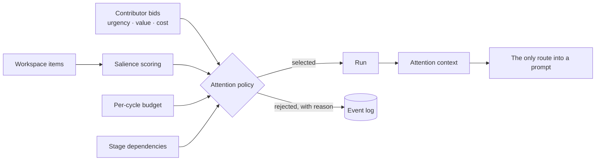
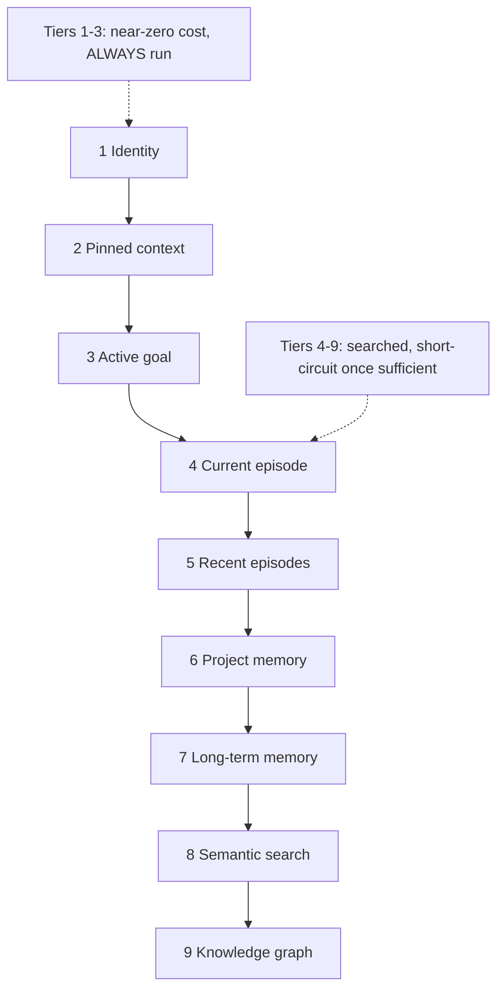
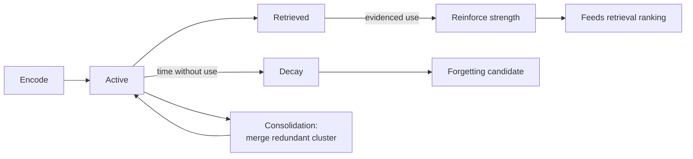
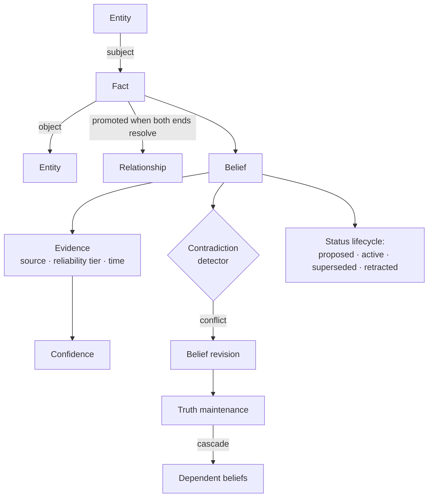
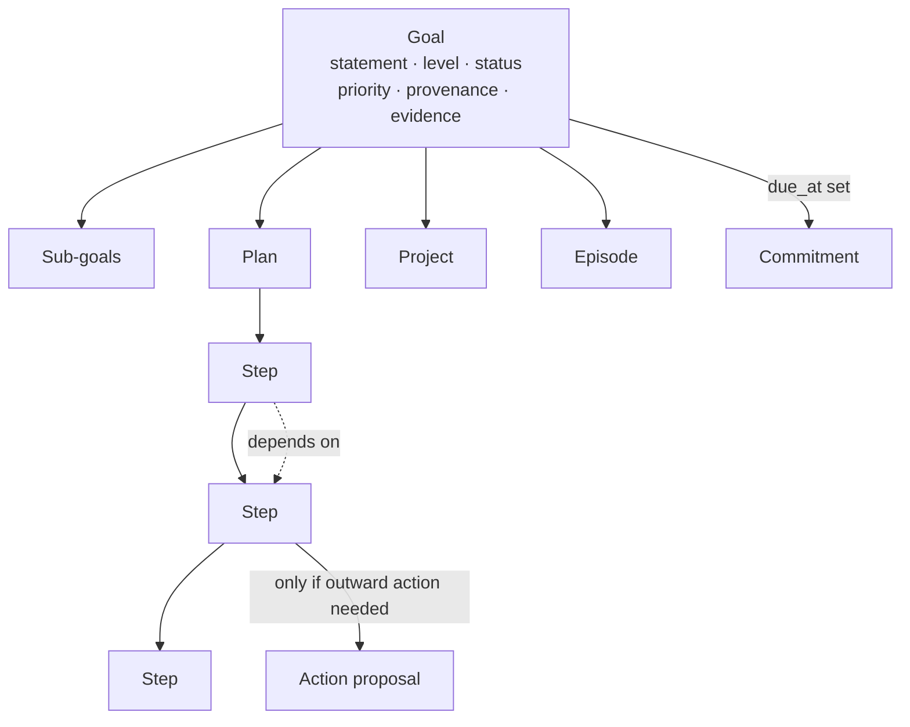
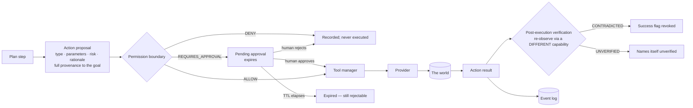

# Cognitive Subsystems

Every major subsystem, at the conceptual level: what it is, why Ashi needs it, how it is
modelled, what flows in and out, what it must never do, and how much of it is running.

Each entry follows the same shape, so subsystems can be read against one another rather
than only in isolation.

Status is marked throughout with the vocabulary defined in
[What Ashi Can Do Today](../status/README.md#the-status-vocabulary): **designed →
implemented → wired → active → verified**, which are not interchangeable.

---

## Contents

**Understanding the input:** [Perception](#1-perception) ·
[Interpretation](#2-interpretation) · [Attention](#3-attention)

**Holding the past:** [Memory](#4-memory) · [Knowledge and Belief](#5-knowledge-and-belief)

**Thinking:** [Reasoning](#6-reasoning) · [Inference](#7-inference)

**Acting:** [Planning](#8-planning) · [Execution](#9-execution)

**Changing:** [Reflection](#10-reflection) · [Learning](#11-learning) ·
[Metacognition](#12-metacognition)

**Being:** [Identity](#13-identity) ·
[Character, Relationship, Presence](#14-character-relationship-and-presence)

**Producing:** [Artifacts](#15-artifacts)

---

## 1. Perception

Ashi has **two distinct perception systems**. They are easy to conflate, so the
distinction is drawn sharply here: one watches the environment continuously, the other
reads a single observation deeply.

### 1a. World perception — the ambient loop

**Purpose.** Give Ashi an always-current, cheap-to-read model of the world it operates in:
which project the person is working on, which repository, which branch, what the working
tree looks like, and what changed since the last message.

**Problem it solves.** Without it, every question about the environment is either
unanswerable or requires the turn to go and look — which is fatal, because looking means
filesystem walks and subprocesses, and that cost lands on the person waiting for a reply.

**Conceptual model.** Sensors observe resource classes (repository state, filesystem
state). An ambient runtime polls them on its own cadence, assembles an immutable snapshot,
and publishes it by pointer swap. The turn reads the snapshot with a lock-free load. A
persisted resource ledger makes each pass incremental rather than a full rescan.

**Inputs:** sensor observations, a permission scope bounding what may be observed at all,
a focus signal (inferred, or explicitly pinned by the person).
**Outputs:** an immutable world snapshot; a per-turn frame; projections into the knowledge
graph and episodic memory.

**Invariants.**
- Off the turn path, always. No turn walks the filesystem or spawns a subprocess.
- **LLM-free by contract.** An ambient loop that spent model quota would exhaust it before
  the person typed anything.
- Observation must not mutate what it observes. Observing repository state is done in a
  mode that leaves the repository's own index byte-identical — an ordinary status query
  does not, which is why this is asserted by a benchmark rather than assumed.
- The frame reaches a prompt only by winning attention. It competes like any other item and
  is designed to lose when the world is irrelevant.

**Status: ACTIVE and VERIFIED.** Turn-path cost measured in tens of microseconds; ambient
pass in the hundreds of milliseconds once per minute at low single-digit percent of one
core; zero snapshot growth across repeated passes. A reproducible benchmark exists that
requires neither a provider nor a database and therefore costs no quota.

**Future direction.** Additional resource classes (calendar, issue trackers, mail) are
`PLANNED` and are gated on a client for external tool protocols — see
[the roadmap](../roadmap/README.md).

### 1b. Cognitive perception — the understanding pipeline

**Purpose.** Turn one observation into a structured *reading*: what kind of thing this is,
what it is about, what is salient in it, and how confident that reading is.

**Conceptual model.** A fixed multi-stage pipeline — a semantic backbone, structural
context, a set of parallel specialists, a situation assembly, a fusion stage, and a reading
builder — followed by cross-turn state: an evolving understanding, and a personal cognitive
model.

**Outputs:** a cognitive reading consumed by reasoning.

**Status: WIRED, conditionally ACTIVE.** It runs as a cycle stage when configured, and
reasoning is its first real consumer. Its contribution to answer quality is `UNMEASURED`.

---

## 2. Interpretation

**Purpose.** Understand what the person actually meant, as distinct from what they
literally said: sarcasm, irony, teasing, exaggeration, indirect requests, emotional
masking, hesitation, confidence, uncertainty, frustration, caution, humour.

**Problem it solves.** Communication understanding was originally a side effect of
computing a relationship refinement. That placed a general concern inside a specific
consumer, and it meant no other subsystem could use it.

**Conceptual model.** A pure function of the current turn's text alone, with no dependency
on any other subsystem's state. Every marker family is evaluated *independently*, and every
candidate that fires is returned — not a winner-take-all waterfall. The highest-confidence
candidate becomes primary; every other candidate within a confidence window becomes an
explicit recorded alternative rather than being silently dropped.

**Key design choice.** The result is never a single boolean. Low confidence stays a
checkable ambiguity flag rather than being resolved into false certainty — a direct
application of the *explicit uncertainty* principle.

**Runs where:** immediately after percept, *before* memory, knowledge, and reasoning.

**Honest scope.** These are deterministic marker and shape heuristics, not natural-language
understanding and not a model call. A stage running before reasoning that called a model on
every turn would add real latency to every turn. One label falls back to a broader one when
its narrower markers are absent — documented as a scoping choice, not presented as a real
distinction.

**Status: ACTIVE**, unconditionally, every cycle.

---

## 3. Attention

**Purpose.** Decide what gets thought about, with a bounded budget, and be the single
admission point for anything entering a model prompt.

**Problem it solves.** Two, actually. Without admission control, prompts grow without
bound and ambient perception is a firehose. Without a scarce budget, no subsystem can
lose, so nothing competes and no priority exists.

**Conceptual model.**

**Salience is structural, never semantic.** It scores recency, urgency, and explicit hints
— it never looks at content. That discipline was originally a simplicity decision and paid
off unexpectedly: it makes salience **modality-agnostic for free**, so an image, an audio
segment, and a line of text compete on the same terms with no new code.

Two further factors are architecturally specified: **goal relevance** (does this item's
causal chain intersect an active goal's provenance — graph reachability, still no
semantics) and **reinforcement** (how often content from this source participated in a
cycle with a positive outcome). Reinforcement is the architecture's first adaptive weight;
it closes the loop from outcome → attention → what gets recalled → next outcome.

**Invariants.** Nothing enters a prompt except through the attention context. Salience
components are always carried alongside the score, so a selection is always explainable.
Rejections are recorded with their reason.

**Status: ACTIVE.** Bidding, budget-bounded dependency-respecting selection, and prompt
admission all run every cycle and genuinely reject. Per-contributor budget *grants*,
cancellation on overrun, and re-admission rounds are `DESIGNED`. Whether attention
selection measurably improves answer quality is `INCONCLUSIVE` — the one live experiment
run against it could not distinguish "attention prioritised correctly" from "the competing
item was never stored in the first place," and is recorded as a failed experiment rather
than a result.

---

## 4. Memory

**Purpose.** Hold experience in a form that can be retrieved by relevance, decays without
use, strengthens with evidenced use, consolidates when redundant, and forgets when it
should.

**Conceptual model — four systems.**

| System | Holds | Character |
|---|---|---|
| **Working** | The current session's live context | Bounded by an explicit window; nothing accumulates |
| **Episodic** | What happened, when, in what episode | Append-only; the raw material for reflection |
| **Semantic** | What is true, independent of when it was learned | Feeds and overlaps the knowledge layer |
| **Procedural** | How to do things; patterns that worked | The tier that turns repeated experience into skill |

### Retrieval: a hierarchy, not a search

Nine tiers, searched in order. The first three are near-zero-cost and always run. From the
current episode onward, retrieval short-circuits as soon as what has been gathered is
sufficient. This replaced a flat similarity search, and it is what makes "what are we
working on?" answerable from *structure* rather than from a lucky embedding match.

### Lifecycle

**Why reinforcement requires evidence.** A reinforcement signal that fires on every turn
does not measure usefulness — it measures *retrieval frequency wearing an outcome label*.
Because ranking reads strength back, such a loop is self-confirming: whatever is retrieved
most is strengthened most, is retrieved more, and within a few dozen ordinary turns an
arbitrary item sits at maximum strength while genuinely important ones do not.

Reinforcement therefore requires real execution evidence — deliberately *not* a success
flag, so a turn that correctly decided to do nothing neither reinforces nor weakens
anything. This is the one place in Ashi where an adaptive loop could quietly corrupt the
substrate it draws on, and it is gated accordingly.

**Invariants.** Append-only records. Embeddings are derived state and must be
regenerable — they belong to the reconstructible tier, and keeping them inside a durable
record would make the tier boundary unenforceable. Retrieval is deterministic and totally
ordered, with near-duplicate collapse.

**Status: ACTIVE.** All four systems, the full nine-tier hierarchy, decay, strength,
consolidation, and forgetting are wired and running. Retrieval *quality* has not been
A/B tested against a baseline — `UNMEASURED`.

---

## 5. Knowledge and Belief

**Purpose.** Represent what is true, with evidence, and revise it correctly when
contradicted.

This is the most research-credible part of the system and the closest thing it has to real
emergent dynamics: a retraction genuinely cascades.

**Conceptual model.**

**Facts vs. beliefs.** A fact is an asserted triple. A belief is a *held position* with
evidence, confidence, and a status lifecycle. The two are not one-to-one — that was a real
bug. Every fact used to produce a belief unconditionally, duplicating the entire graph into
the belief store. A belief is now formed only on a genuine conflict, which is what a belief
is for.

**Confidence** is computed from evidence: how many references support it, how many
contradict it, and the reliability tier of each source. Contradiction counts genuinely
accumulate rather than applying a flat penalty — an evidence-weighted revision, not a
strike system.

**Truth maintenance** is what makes this more than a database. Retracting a belief
propagates to beliefs that depended on it, which is a cascade with real dynamics.

**Temporal reasoning** is partial and honest about it: beliefs carry time, and a temporal
priority policy prefers more recent evidence when resolving conflicts. General temporal
logic — reasoning about intervals, about what was true when — is `DESIGNED`, not built.

**Assimilation discipline.** Knowledge is extracted on an **explicit trigger only**. Ashi
does not silently ingest everything said to it. Extraction is layered: a cheap
deterministic parse first, and a model-based extractor whose output carries a *lower source
reliability tier* and therefore lower confidence. Both feed the same validated assimilation
path — a lower-quality extractor cannot launder its output into high confidence by taking
a different route in.

**A guard worth naming:** input asserting things about Ashi's own identity is detected and
refused. Identity is not writable by conversation.

**Write authority.** A single narrow contract governs who may write to the graph. It
exists because a component can otherwise reach the store directly and bypass the entity
resolution and contradiction detection every other writer passes through — producing a
graph that looks correct and has never been checked against itself.

**Status: ACTIVE.** Entities, facts, relationships, beliefs, evidence, confidence,
contradiction detection, revision, truth maintenance, temporal priority, and the layered
extraction path all run. Belief *accuracy over time* has never been independently measured
— `UNMEASURED`. One known scaling risk is recorded: certain graph queries have no result
bound and are O(N) in graph size.

---

## 6. Reasoning

**Purpose.** Draw conclusions from what is in the workspace, with calibrated confidence.

**Conceptual model.** A family of inference strategies over an ephemeral per-cycle world
model:

| Strategy | Used when |
|---|---|
| **Chain of thought** | Ordinary inference; tight budget |
| **Self-consistency** | Confidence matters more than latency |
| **Tree of thoughts** | The workspace holds contradictions or the problem branches |
| **Causal** | The question is about cause, effect, or a counterfactual |

Strategy selection is dynamic, driven by request complexity and available budget rather
than fixed. Without it, a strategy family collapses into whichever strategy is selected by
default: the others remain implemented, tested, and unreachable.

**The world model** is an ephemeral per-cycle aggregate: active goals, working-memory
notes, recalled content, world state, and the cognitive reading. It is rebuilt every cycle
and is not a store.

**The non-committing boundary — the most important invariant here.** Reasoning **never
writes to memory or knowledge**. Inference must not silently become belief. Anything
reasoning concludes reaches durable state only by going through the assimilation path,
with its own provenance and its own reliability tier.

**Status: ACTIVE** for chain of thought, self-consistency, tree of thoughts, and strategy
selection. **Causal reasoning is PARTIALLY_ACTIVE and was DORMANT until recently** — the
strategy was fully implemented and wired, but the field it required was never populated by
its caller, so it returned a degraded "no causal subject identified" conclusion on every
single turn. It is now populated when a plan step supplies it, which is narrower than the
strategy's design. Whether strategy selection correlates with outcome quality is
`UNMEASURED`.

---

## 7. Inference

**Purpose.** A bounded, structured, local, CPU-first inference primitive — deliberately
*not* conversational text generation.

**Problem it solves.** Intent detection by regular expression cannot understand natural
language. It cannot resolve *"BBC must have released a new video, play it"*. Widening a
literal-phrase list one observed sentence at a time is not a convergent strategy, and that
was demonstrated repeatedly: each live session found another phrasing the list did not
cover.

**Conceptual model.** An engine with a pluggable backend, a schema registry, grammar
support (designed, not enabled), a health monitor, a lifecycle, and a request trace.
Requests are structured-output only: the caller registers a schema, and the result is
either a validated object or an explicit failure. There is no free-text path.

**Why it is separate from the conversational model layer.** Different job, different
constraints, different failure model. One produces prose and is cloud-routed and
quota-bound. The other produces bounded decisions and must be cheap, local, and available.
Conflating them would make intent understanding inherit the cost and availability profile
of conversation.

**Status: ACTIVE, with a disclosed capability limit.** A cloud-backed engine is the primary
path and a local quantised model is the offline fallback; the fallback activates only when
its weights are actually present on disk, because a silent preload failure would otherwise
degrade every action turn.

**The honest capability finding**, because it drove a real architectural decision: a
systematically benchmarked sub-2B local model, after a full prompt and schema
production pass, reached strong numbers on almost everything — schema validity above 90%,
parameter accuracy from 23% to 80%, decode determinism at 100%, latency roughly halved —
and **remained unreliable at exactly one thing: deciding that no action is required.**
That failure was investigated rather than assumed:

- **Quantisation was ruled out** — the no-action accuracy was byte-identical at two
  quantisation levels while every other metric moved, proving the comparison was sensitive
  and detected nothing here.
- **Prompt engineering was ruled out** — categories explicitly named in the prompt, one of
  them demonstrated by its own in-context example, failed at the identical rate as
  categories the prompt never mentions.
- **The failure is structural, not semantic** — near-total failure on every kind of
  well-formed conversational input, and no failure at all on degenerate input.

The conclusion was **not** to discard the model, and **not** to ship it unguarded. It was
to route its output through the permission boundary that already exists for exactly this
class of problem. A model that is good at *which action* and bad at *whether* is safe
behind a gate that asks before acting, and that gate was already an architectural
requirement for other reasons.

Grammar-constrained decoding is `DESIGNED` and deliberately not enabled: the evidence
pointed at prompt and schema fixes first, and grammar becomes the right next step only if
vocabulary drift survives them.

---

## 8. Planning

**Purpose.** Turn intentions into structure that survives: goals that decompose, plans that
execute, commitments that come due.

**Conceptual model.**

**Goals** carry a level (from lifetime down to task), a status lifecycle deliberately
mirroring the belief lifecycle — a goal is an intention held with justification, so the
lifecycle that works for beliefs works here — priority, **provenance** (the events and
beliefs that motivated adopting it), and **evidence of progress**.

**Plans** are dependency graphs of steps, not lists. A step needing outward action carries
an action proposal; a purely cognitive step does not. That absence *is* the distinction —
there is no step subtype.

**Commitments** are not a new concept. A commitment is a goal with a deadline. That
decision avoided an entire parallel store: the status vocabulary already existed, due and
overdue are derived rather than stored, and restart durability came for free. Detection is
deliberately conservative — it requires both a commitment cue and a stated time, and it
**never invents a deadline.**

**Projects and episodes** provide continuity. An episode is a unit of coherent work that
can be suspended, resumed, interrupted, and retired. A project outlives episodes and is
what "what are we working on?" resolves against.

**Revision, not blind replanning.** When a step genuinely fails, the planner diagnoses the
real error and repairs the plan — inserting a missing prerequisite step and retrying —
rather than marking it failed and giving up. Repeated *equivalent* failures force a
strategy change rather than a retry of the same fix, and exhaust to a terminal state that
reconciles the goal and every plan revision for it.

**Two structural rules govern completion**, and both exist because their absence is
silently catastrophic:

- **An empty plan is a failure, not a success.** "All steps completed" is vacuously true
  over zero steps. Left unguarded, that single vacuous truth marks every stated commitment
  as achieved within milliseconds of being made — and an achieved commitment is, by design,
  excluded from the proactive sweep that would otherwise raise it. An empty plan is an
  explicit no-action outcome instead.
- **Achievement requires execution evidence.** A goal cannot reach an achieved state
  without a record that something actually ran.

**Status: ACTIVE and VERIFIED** for goal, plan, step, project, episode, and commitment
persistence across real process restarts, and for diagnosis-and-repair replanning. Goal
formation from natural language is `PARTIALLY_ACTIVE` and known-imperfect: a question can
still occasionally be mistaken for a goal statement.

---

## 9. Execution

**Purpose.** Let Ashi affect the world, through exactly one gated path, with verification
afterwards.

**Conceptual model.**

**The boundary's responsibility is exactly one thing:** classify risk and return allow,
deny, or requires-approval. It does not execute, does not know how tools work, and does not
decide how approval is obtained — only that it is required. **High risk never
auto-allows.**

**Approvals are asynchronous and expire.** A paused plan resumes from the paused step, with
no replanning and without re-consulting the boundary — deliberately, because re-asking
would never terminate. That made the stored approval the only thing standing between an
approval command and a high-risk call, and it had no deadline. It now has one. An expired
approval can still be *rejected*, so it can never become unresolvable.

**Post-execution verification** exists because a provider's `success` flag is the
provider's self-report. A claimed success is re-observed through a **different capability
than the one that wrote it**, and a contradicted result *loses its success* — which
propagates, with no further wiring, to the execution record, to whether the goal counts as
achieved, and to what the person is told.

**Coverage is one of eight applicable action classes.** Everything else returns
`UNVERIFIED`, naming itself. That is a deliberate design property: never a silent pass.

**Policy.** A policy layer can only ever *add* friction — deny, or force approval. It can
never grant auto-allow for something risk classification already marks high. The invariant
is enforced, not documented. Most "always ask before X" policy is already the honest
default, because an unregistered action type classifies as high risk and therefore always
requires approval.

**Environment isolation.** Execution and storage carry an explicit environment
identity — production, test, or read-only audit — enforced at the shared database
chokepoint and both filesystem write chokepoints. Read-only audit rejects every write
unconditionally; test refuses to connect to a non-disposable database or write outside an
explicit confinement root.

This is a boundary that only becomes obvious once it is missing. Anything holding a
connection to durable state — a maintenance routine, a verification pass, a test harness —
can reach production state by default unless something structurally prevents it, and losing
durable state costs more than any single capability it supports. The environment identity
is resolved once and enforced at the chokepoints, rather than checked at each call site.

**Status: ACTIVE and VERIFIED** for the whole chain — natural-language intent, through
inference, to a plan, to a proposal, through the boundary, to a real provider, to a real
file on disk, verified by reading the disk independently rather than trusting the result
object. Multi-step dependency-ordered execution with runtime value propagation between
steps is likewise verified against real providers and a real filesystem.

**Sandboxing is the significant open item.** Some providers execute with real host
privileges. A closed, side-effect-free system-tool vocabulary is deliberately exempt from
the boundary and is bounded by construction; arbitrary execution is not, and a general
isolation mechanism is `DESIGNED`, not built.

---

## 10. Reflection

**Purpose.** Evaluate what happened, notice when the world diverged from expectation, and
propose change. Reflection is the consumer of the episode log and the producer of most
feedback in the system. **It is the reason the event log exists.**

**Conceptual model.** Four operations: evaluate a closed episode; criticise the evaluation;
summarise many episodes into an insight; and *predict* — register an expectation after a
cycle completes, so that a later divergence is detectable.

**Prediction error is the signal.** When a registered expectation diverges from a later
outcome, reflection raises an interrupt. Surprise is the cleanest available trigger for
consolidation, for salience reweighting, and for a mode shift — because surprise is the
signal that the current model of the world is wrong.

**What reflection targets:**

| Target | Effect |
|---|---|
| Response quality | Feeds the reinforcement salience factor |
| Recall accuracy | Useful memories strengthen |
| Belief reliability | Confidence revised through the existing revision path |
| Repeated mistakes | Become an insight, and then procedural memory |
| Self-model drift | Identity — and reflection is its only automated writer |

**Invariants.** Reflection **proposes; it never writes**. It runs on the background path,
triggered by accumulated importance over unreflected episodes, never inside a user-facing
cycle — so it can never add user-perceived latency.

**Status: ACTIVE.** Runs every cycle in the background; its output is consumed by learning
and by the interrupt path.

---

## 11. Learning

**Purpose.** Convert experience into durable change, safely.

Learning is **not** knowledge assimilation. Assimilation is explicit-trigger extraction.
Learning is the process that decides what is worth assimilating, verifies it, and adjusts
the system's own parameters.

**Conceptual model.** Four operations:

- **Ingest** long-form external sources with chunking, entity linking against the existing
  graph, and provenance capture.
- **Verify** new claims against existing beliefs *before* integration, routing conflicts
  through the contradiction path.
- **Integrate** through the existing validated assimilation path. No new write path.
- **Adapt** — the parameter loop. Read outcomes, propose bounded changes to retrieval
  ranking, salience weights, and budget policy.

**The four safety properties, which are the whole point:**

1. **Learning never writes directly to any store.** It emits proposals; the owning
   subsystem commits them through its own validated path.
2. **Every change is an event** — inspectable and attributable.
3. **Every change is bounded and revertible.**
4. **Risk gates auto-apply.** Above a risk threshold, a proposal requires approval rather
   than applying itself.

Together: Ashi tunes itself within a sandbox it cannot escape.

**Cross-objective learning.** Failure-signature lessons persist and are consulted by
*different* future objectives, surviving a real process restart. A past objective's proven
dead end changes a genuinely different future objective's first repair strategy — and this
was demonstrated as a real before/after behavioural difference, not as an event being
emitted.

**Status: ACTIVE.** Runs in the background, consumes reflection's output, and writes
through validated paths. Identity suggestions are applied. Evidence-accumulated confidence
revision is live.

**What is honestly not established:** that learning makes Ashi measurably better over
time. That is `UNMEASURED` and is stated as an open research question, not a feature.

**A historical constraint that any future learning work must respect:** the event log
contains a number of false success outcomes from before the integrity fixes described
above. Behaviour changed from the fix forward; **the past was not rewritten.** Anything
training on history must exclude events before that boundary.

---

## 12. Metacognition

**Purpose.** Let Ashi model its own reliability — which of its tools and strategies have
been working — and act on it.

**Conceptual model.** A self-model, refreshed in the background, holding caution signals
derived from recorded outcomes. Two channels:

- **Tool caution** — `ACTIVE`. Derived from real recorded tool outcomes and genuinely
  consulted during provider selection.
- **Strategy caution** — `DORMANT`. Implemented and reachable, but it depends on an
  evaluation that nothing in the automated loop currently produces, so it always yields
  nothing. A clear instance of the difference between *wired* and *active*.

The self-model also feeds a **capability self-model**: when asked whether it can do
something, Ashi answers from its live capability registry rather than from a model's guess.
A refusal grounded in the real registry is `VERIFIED` behaviour.

---

## 13. Identity

**Purpose.** Be the thing that persists. Identity is what makes the fifty-year claim
meaningful and the self-improvement claim safe.

**Conceptual model.** Structured, versioned, file-backed data: profile, components,
personality traits, **values**, **constraints**, capabilities, and metadata. Atomic writes,
full version history, rollback.

**Two properties do all the work:**

- **Identity is data, never process state, and never prompt text.** It is readable and
  editable without running Ashi's code. This is what makes the "is it still the same
  individual?" question *answerable* — identity is specified, not merely accumulated.
- **Identity has an immutable core.** Values and constraints marked as core cannot be
  modified, removed, or downgraded by any automated process. Only the human, explicitly,
  with confirmation.

**Without the immutable core, self-improvement is unbounded value drift.** With it, Ashi
can change how it thinks and what it knows, but not what it is for. This is the structural
expression of *human first*, and it is the single most important safety property in the
architecture.

**Exactly one automated writer: reflection**, and only with a justifying insight, and every
update emits an event. That is the mechanism of "evolve without becoming a different
individual."

**Status: ACTIVE and enforced**, and worth one caveat about what "enforced" means. A
guard of this kind is only as real as the data it is pointed at: a correct, fully tested
rejection of changes to core values protects nothing at all if no value is actually marked
core. The guard and the marked core are two separate things, and both have to be true.

---

## 14. Character, Relationship, and Presence

Three layers that shape *how* a decision is expressed, and never *what* is decided. They
run after the decision, in order, each refining the last.

### Character — how this turn should be expressed

A pure per-turn function of personality, the reasoning result, and the input, choosing
among a small closed set of behaviours: answer (the default), teach, challenge, ask a
clarifying question, warn, encourage. Plus a phrasing layer over already-calibrated
confidence — a hedging vocabulary, never a second confidence computation.

Character is a **consumer of identity, never a writer**. Nothing in it carries state across
turns.

### Relationship — one specific, ongoing human relationship

The first genuinely persisted layer above character. A single durable state: a
forward-only relationship stage, trust, familiarity, shared history, recurring topics,
long-term goals the person has voiced, teaching history, communication preferences, and
interaction patterns. It reads the character decision and refines it, then records what
happened after the turn completes.

A true singleton — this is a genuinely single-user system, and the model reflects it.

### Presence — rhythm, initiative, and not sounding like a generic model

Decides pacing, whether to take initiative, how to sequence teaching, and actively flags
corporate and generic-assistant phrasing.

**Structurally cannot change what Ashi does.** Its output type has no field capable of
expressing an action — a guarantee by construction rather than by convention.

Its initiative channel is disciplined: at most one candidate per turn, only when the
decision was a plain answer, and only past the first conversation.

**Status: all three ACTIVE**, every cycle. All three are deliberately deterministic
heuristics rather than model calls — three stages before the response that each made a
model call would add real latency to every turn.

---

## 15. Artifacts

**Purpose.** Produce real documents, presentations, and spreadsheets as first-class
cognitive outputs rather than as text pasted into a chat window.

**Conceptual model.** A canonical artifact with a multi-state lifecycle including named
failure states, revision history, optimistic concurrency, and project association. Real
exporters to standard office formats and PDF. Generation, revision, and conversion between
media are model-driven; **export is the only artifact operation that touches the
filesystem**, and it is a normal execution provider subject to the normal permission
boundary.

Structural editing, undo and redo (built on the existing revision history rather than a new
store), real conflict handling rather than silent overwrite, formulas restricted by an
allowlist — **Ashi never evaluates a formula; only the spreadsheet application does, on
open** — charts, themed layouts, and cancellation are all implemented.

**Invocation is by explicit command**, mirroring the same discipline document indexing
uses, rather than by inferred intent.

**Status: IMPLEMENTED and WIRED; not yet exercised by a person.** Every capability above
is covered by tests on the generating side and type-checked on the rendering side, and none
of it has been used by a human being — real code, real tests, never clicked through.
