# Roadmap

Capability milestones, not dates.

Where Ashi stands today is in [What Ashi Can Do Today](../status/README.md). This document
is about direction: what is complete, what is being worked on, and what the long arc looks
like.

---

## The arc

```mermaid
graph LR
    A[Cognitive<br/>substrate] --> B[Cognitive<br/>activation]
    B --> C[Knowledge &<br/>world model]
    C --> D[Adaptive<br/>learning]
    D --> E[Planning &<br/>execution]
    E --> F[Proactive<br/>cognition]
    F --> G[Multimodal &<br/>ambient]
    G --> H[External world<br/>integration]
    H --> I[Tutor]
    I --> J[Continuity<br/>& evolution]
    style A fill:#2d5016,color:#fff
    style B fill:#2d5016,color:#fff
    style C fill:#2d5016,color:#fff
    style D fill:#2d5016,color:#fff
    style E fill:#2d5016,color:#fff
    style F fill:#4a5d23,color:#fff
    style G fill:#6b5b1f,color:#fff
    style H fill:#6b5b1f,color:#fff
    style I fill:#5c2e2e,color:#fff
    style J fill:#5c2e2e,color:#fff
```

The ordering is not arbitrary. Each stage is gated on a property the previous one
establishes:

- Learning needs reflection, which needs a causal record of what actually happened.
- Plan revision needs outcome evaluation — revising without it is replanning blind.
- Ambient input needs attention as admission control; without it, continuous perception is
  simply unbounded context growth.
- The tutor comes late because it is the **integration test for the whole architecture** —
  the one application where memory, knowledge, planning, reflection, and multimodal output
  must work together on a timescale of years.
- Continuity certification comes last because it is a property of a complete system.
  Testing it before the subsystems exist tests nothing.

---

## Complete

**Cognitive substrate.** The causal event log; the cognitive cycle and its contributor
framework; attention with salience, bidding, and a bounded budget; executive control and
interrupts; the separation of the conversation path from the background path; persistent
storage; model routing that degrades rather than fails.

**Cognitive activation.** The stage that connected what had been built. A cognitive
architecture accumulates complete, well-tested subsystems that nothing calls — memory decay
and strength, consolidation, forgetting, additional reasoning strategies, attention budgets,
learning adaptation. Activation is a distinct engineering problem from construction, and
treating it as one is why the status vocabulary in this documentation separates *implemented*
from *active*. This stage also cut response-start latency by roughly a factor of six.

**Knowledge and world model.** Ambient perception off the conversation path; projection of
what is perceived into the knowledge graph and episodic memory; a persisted current-state
model; entity resolution; document indexing on explicit trigger; an explicit focus override
with a provenance surface.

**Adaptive learning.** Reflection and learning on a shared background scheduler;
evidence-accumulated belief revision; scoped hierarchical retrieval replacing flat recall;
persistent goals, episodes, and identity continuity; metacognitive self-modelling; a
certification harness covering the cognitive stack end to end.

**Planning and execution.** Goals, plans, projects, episodes, and commitments, all surviving
process restarts. The permission boundary with risk classification, asynchronous approval,
resume, and expiry. Diagnose-and-repair replanning. Verification after execution. Real
outward action, proven end to end against a real filesystem.

This stage carried the system's hardest integrity work. The defining defect: a plan with no
steps satisfied "all steps completed" vacuously, which became goal achievement, which
excluded it from the proactive sweep — so a stated commitment could be filed as an
accomplishment in under a second. Three mechanisms now prevent it: an empty plan is an
explicit no-action outcome, achievement requires execution evidence, and silence about a
failed action is treated as a failure mode rather than as neutral.

---

## Active

### Proactive cognition

The mechanism is complete: the sweep, commitment detection, deadline derivation, initiative
selection, and delivery. The first unprompted contact in the system's lifetime has been
delivered — raised about a real commitment whose deadline had passed, with no message
initiating it.

What remains is turning that from singular into routine, and closing the loop that makes a
proactive contact *useful*: anything Ashi surfaces on its own carries its reason and a
one-click dismissal, and that dismissal is designed to become an outcome event feeding the
reinforcement signal. The dismissal is training data, structurally.

### External world integration

Capabilities for mail, calendar, code hosting, and generic HTTP, plus broader enforcement of
the policy layer — which can only ever *add* friction to the permission boundary, never grant
an action more latitude than risk classification already allows.

---

## Next

### Replay

The largest gap between architectural ambition and reality, and therefore the highest-value
remaining work.

- **Re-execution replay** — re-run a cycle from the log and assert identical results. This is
  what makes an emergent architecture accountable rather than merely lively.
- **Counterfactual replay** — re-run real history with a changed component: different
  salience weights, a different reasoning strategy, a different model. Diff the outcomes
  against ground truth already in the log.

The second is a research instrument. It would make Ashi's own architecture **empirically
tunable** rather than tuned by argument, and it is the prerequisite for verifying model
migration. Nothing else on this roadmap unlocks as much.

### Reliability

Verification after execution across more than one class of action. Execution sandboxing —
currently the most significant open safety item. A working failure-injection campaign.
Concurrency and provider-resilience testing. A genuine long-duration soak.

### Live use

Not a feature, but the gate on several capability claims. The voice pipeline has never been
spoken to; the artifact workspace has never been used by a person. Both work.

---

## Later

### Multimodal and ambient cognition

A first slice is complete: turn-level interaction state, a voice pipeline reachable from both
terminal and browser, a canvas with contextual cognition on selection, and artifact
generation across documents, presentations, and spreadsheets.

Remaining: continuous duplex voice with barge-in and predicted turn-taking; image, screen,
camera, and sensor input as first-class percepts; the consent model actually governing live
capture; an ambient desktop with a global overlay and the causal log rendered as a navigable
timeline; and mobile as a capture surface that runs no cognition and holds no durable state.

The architectural work for most of this is already done, and in an unusually clean way:
salience scores structural shape rather than content, so an image and a line of text compete
on identical terms with no new mechanism. Model routing already drops providers that cannot
handle a request's content, so a model without vision capability is filtered exactly as one
without tool support is today.

### Tutor

The objective is not answering questions but **producing verified mastery** — the ability to
reconstruct, apply, and transfer a concept without assistance, measured rather than assumed.

The strongest argument for the whole architecture is that a serious tutor needs almost no new
cognitive machinery. The concept graph is the knowledge graph. The curriculum is goal
decomposition with prerequisite dependencies. Spaced repetition is the existing decay and
strength machinery. Difficulty adjustment is reflection. And the tutor is itself a
contributor that bids on due reviews and detected misconceptions — so tutoring happens
*inside* ordinary interaction rather than in a separate mode.

Genuinely new: a model of the learner, with mastery estimates and a misconception registry,
deliberately kept separate from identity.

---

## Long-term

**Continuity and evolution** — proving the decades-long claims by testing them:

- Model migration verified through counterfactual replay against real history.
- Embedding migration: re-index derived state under a new model with no change to durable
  state.
- Knowledge ageing: domain-specific staleness driving revalidation. Some beliefs about a
  person are stable for decades; some are stale in a week, and nothing currently
  distinguishes them.
- **Full continuity certification: export → wipe → import into an empty database → verify.**
  This single experiment is what would turn Ashi's central claim from a design property into
  a demonstrated one.
- Fault injection across every degradation level.
- Encryption at rest, access control, and a hardware migration rehearsal.

---

## Deliberately not pursued

Kept in the record, because the reasons explain the shape of the system.

| | |
|---|---|
| **One-directional dataflow** | Abandoned. Formally incompatible with a system that improves from experience; replaced by an invariant that preserves debuggability while permitting feedback through a single explicit channel |
| **"Stateless where practical"** | Abandoned. Correct for infrastructure, wrong for cognition — a cognitive system's state *is* its cognition |
| **Keyword-based intent detection as a fallback** | Removed deliberately. A degraded understanding path must never silently produce a guessed action; it now degrades to no action |
| **A separate store for commitments** | Never built. A commitment is a goal with a deadline; a parallel store would have duplicated an entire lifecycle for no gain |
| **Simulation in the production loop** | Deliberately isolated to evaluation, enforced as an architectural invariant |
| **A generic client for external tool protocols** | Deferred in favour of native external capabilities; still on the map |
